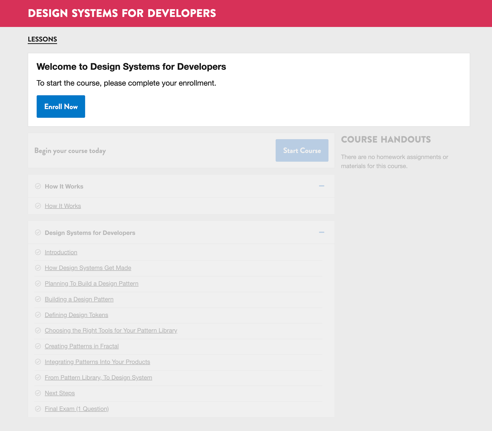
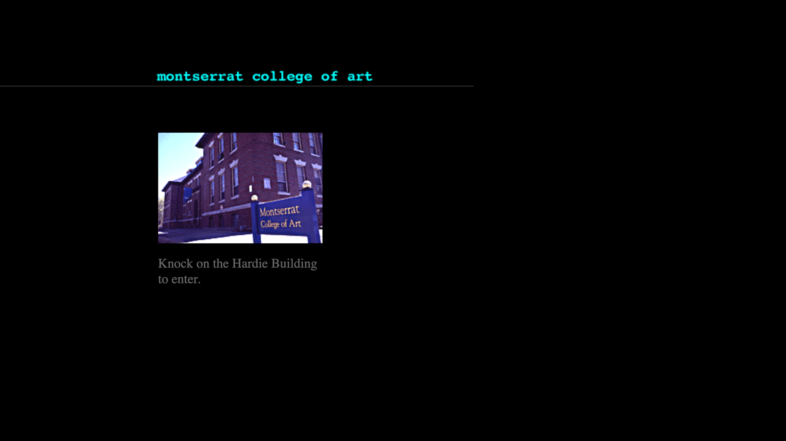
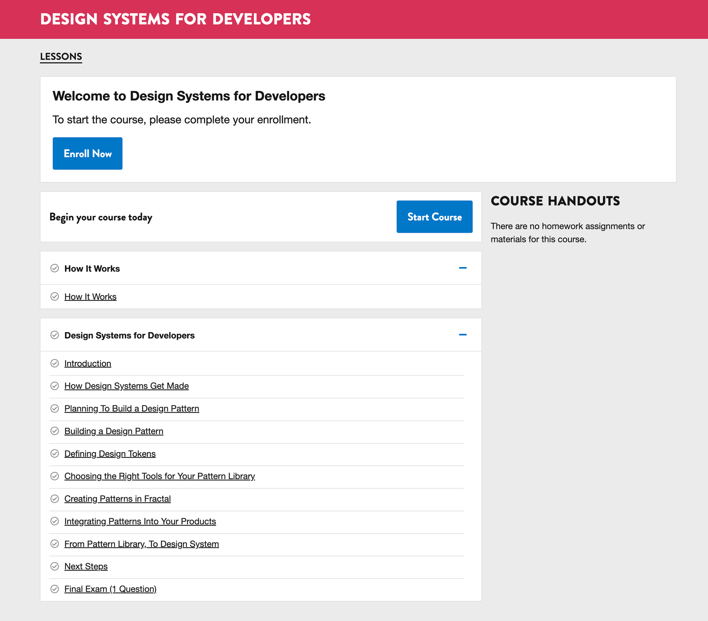
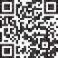

## Slide Graveyard

---

We offer free online courses and tutorials on design, development, UX, prototyping, accessibility, and career skills.

Since 2013, we’ve reached over 160,000 students from more than 200 countries and regions, and issued over 20,000 credentials.<!-- .element: class="fragment" data-fragment-index="1" -->

For many students, these credentials — certificates and badges — significantly increase their chances of landing a job.<!-- .element: class="fragment" data-fragment-index="2" -->

---

## Course Offerings: 2015

- 5 Full Courses
- 3 Short Courses

Notes:
When we lauched on open edx in 2015, we started with 5 full courses and three short courses.

---

### Screencap: March 2016<!-- .element: class="hide" -->

Notes: a sample of Gymnasium a decade ago.

---

## Course Offerings: 2025

- 10 Full Courses (6 live, 4 retired)
- 19 Short Courses (15 live, 4 retired)
- 61 Tutorials (60 live, 1 retired)
- 1 Workshop (2024 pilot with a small cohort in real-time)

Notes: (Justin)
Since 2015, Gymnasium’s course catalog has expanded, not just in quantity, but also in topic and format. Retired courses remain accessible to learners, while new formats like our 5-minute tutorials and the 2024 live format portfolio workshop pilot helped meet diverse learning needs.

---

### Screencap: June 2025<!-- .element: class="hide" -->

Notes:
- Here is what our course catalog looks like now.
- Our design language hasn’t changed much, but it has simplified and aged into a fine wine.

---

<!-- .slide: data-background="black" -->
## Design-Development Philosophy

- The journey to a seamless learner experience began in summer 2015.
- Transitioning to Open edX brought design and development in-house.
- I led design while prototyping in HTML/CSS to streamline collaboration.
- Our small, five-person team worked collaboratively across roles.
- My role focused on the visual front end, enabling developers to concentrate on core platform work.

Note:
The journey toward a seemingly seamless learner experience started in the summer of 2015.

Originally, I had ghostwritten a course and worked as a teaching assistant.

When we migrated from a custom LMS to Open edX, the design and development process became in-house, with Mike Bifulco as “The Engineering Team” and myself as “The Design Team.” I prototyped directly in HTML and CSS, helping make the design and development workflow more seamless.

It was a small team of five: each doing distinct work, rarely siloed, and often collaborative.

Before I joined as design lead, the visual design was created by a previous team member in Photoshop, producing incredible comps that were later developed into functional code by another teammate.

My involvement freed up the development team to focus on theming and core Open edX development, allowing me to concentrate on the visual, display layer, specifically the front end of the marketing website and Open edX. The result was a more harmonious design and development process with closer collaboration.

---

## Change is Inevitable

- Research new hosting providers
- Discovery that an upgrade is necessary
- We knew we were on a sinking ship
- Urgency was paramount
- Change the overall architecture (frontend + LMS)

Notes:

---

## Research phase

Post Hawthorn Open edX (Olive...Palm)

- MFEs
- Noticed MFEs weren’t built consistently
- Confusing implementation - some parts of LMS were the theme, others were MFEs.

Notes:
Started learning the MFEs in 2023/2024 etc.

---

<!-- .slide: data-background="black" class="" -->

---

---

## Errors

Notes:
Here’s how we approach handling customized error messaging.

------

<!-- .slide: data-auto-animate -->

<h2 data-id="code-title">404 YAML</h2>
<pre class="code-wrapper" data-id="code-animation">
  <code class="language-yml"
    data-line-numbers=""
    data-trim
    data-url="code-samples/error-404.yaml"
    ></code>
</pre>

Notes:

------

<!-- .slide: data-auto-animate -->

<h2 data-id="code-title">404 HTML</h2>
<pre class="code-wrapper" data-id="code-animation">
  <code class="language-html"
    data-line-numbers=""
    data-trim
    data-url="code-samples/error-404.html"
    ></code>
</pre>

Notes:

------

<!-- .slide: data-background="black" class="" -->

### 404 Page

<!-- .element: class="r-fit-text" data-id="screencap" -->

Notes:

---

<!-- .slide: data-background="black" class="" -->

## Meta data

Notes:

------

<!-- .slide: data-auto-animate -->

<h2 data-id="code-title">Meta YAML</h2>
<pre class="code-wrapper" data-id="code-animation">
  <code class="language-yml"
    data-line-numbers="|8"
    data-trim
    data-url="code-samples/meta.yaml"
    ></code>
</pre>

Notes:
Here’s an example of how we handle the site meta - those unseen elements that are so useful for SEO and web crawling spiders sent by search engines such as Google, Yahoo, Bing, etc, ad nauseam

Oh wait, what’s Twitter doing there?

Let’s cancel that.

------

<!-- .slide: data-auto-animate -->

<h2 data-id="code-title">Meta YAML</h2>
<pre class="code-wrapper" data-id="code-animation">
  <code class="language-yml"
    data-line-numbers
    data-trim
    data-url="code-samples/meta.yaml"
    data-line-end="7"
    ></code>
</pre>

Notes:
Next, the JSON

------

### META JSON

<pre class="code-wrapper" data-id="code-animation">
  <code class="language-json"
    data-line-numbers
    data-trim
    data-url="code-samples/meta.json"
    ></code>
</pre>

Notes:
The JSON gets generated from the YAML.

------

### Meta HTML

<pre class="code-wrapper" data-id="code-animation">
  <code class="language-html"
    data-line-numbers="6,10,11,12,13,14"
    data-trim
    data-url="code-samples/meta.html"
    ></code>
</pre>

Notes:
And the resulting rendered HTML.

---

- The original design and development philosophy still guides our work nearly a decade later.
- Open edX—and our approach—has matured over time.
- My philosophy centers on the learner, with design leading development.
- We build with a content-first mindset and human-readable structure.
- I advocate for using core web technologies over frameworks by default.

Note:
Almost 10 years later, that design and development philosophy persisted, in some ways becoming ubiquitous to how we, and I, work.

Open edX has matured, and so have we.

My design and development philosophy is centered around the student, the learner, if you will. With visual and experience design coming before development. Designing a better learner experience is intentional, yes, but it’s also a natural byproduct of the way we build.

That way of building combines a content-first mindset with human-readable data and structure, for people, for robots, and for the tools we rely on.

It means championing core web technologies like HTML, CSS, and JavaScript, not frameworks by default. Frameworks have their place, but the foundation should be written in plain, readable code. Not markup soup.

---

## Deployment Process Overview

- Process is streamlined and reduces the dependency/intervention from the hosting provider.
- We make changes in the SSG, deploy that (2-5 minutes)
- Trigger a rebuild of the open edx systems (35-45 minutes)

Notes:
We are the ideal client for hosting providers - the only intervention hosting providers needed was to handle emergencies.

---

## Pain = Healing

10 versions in 10 hours, with 10 days of prep & planning.

Notes:
The upgrade was huge pain point, but Amir’s help made this step so much easier.

---

## Why not use Paragon?

(for the uninitiated, Paragon is Open edX’s design system)

- Well, we are (sort of)
    - we still use Paragon’s interactivity (the interactive react components)
    - copied core bits of MFE CSS and customized that
    - in some cases, we eliminated it altogether and wrote our own rules
- Path of least resistance
- we already have our own design language
- easier to push ours forward instead of using the styles built into paragon

---

# Conclusion<!-- .element: class="hide" -->

<!-- .slide: data-background="black" -->

## ⚡ Fasten your seat belts

Notes:

---

### unexpected turbulence<!-- .element: class="hide" -->

unexpected turbulence!

Notes:

---

### things go wrong<!-- .element: class="hide" -->

anything that can go wrong will go wrong

Notes:

---

### can’t plan for everything<!-- .element: class="hide" -->

you can anticipate and plan for all sort of outcomes, but the one you don’t account for is…

Notes:

---

## Reaching altitude 🛫

Notes:
As far as next steps...

---

### next: eleventy upgrade<!-- .element: class="hide" -->

upgrade to next version of eleventy

Notes:

---

### next: open edx upgrade<!-- .element: class="hide" -->

update from redwood to sumac and beyond

Notes:

---

### next: new courses<!-- .element: class="hide" -->

new course development

Notes:

---

The end of Gymnasium: in a moment of crisis, design & development was incredibly easy for us.

We made an incredibly flexible, agile environment - scaling up & scaling down/back

Notes:
[optional]: say something about "graceful degradation"
Designing for crisis: all the work we did made it so much easier to transition to a non-LMS site.

---

### always a better way<!-- .element: class="hide" -->

there is always a better way

---

Notes:
- with these things in mind, this could mean there are better ways to do what we did, and we welcome any feedback

### Artist<!-- .element: class="hide" -->

------

### Art School<!-- .element: class="hide" -->

Note:
Montserrat College of Art’s website circa 1996 designed by John McVey.

------

### free online courses and tutorials<!-- .element: class="hide" -->

Notes:
- 

---

### on design...<!-- .element: class="hide" -->

Notes:

---

### lessons learned<!-- .element: class="hide" -->

lessons learned 📝

Notes:
- We overcame styling, asset, and content challenges.

---

## Why we’re here

Notes:
- Enough... let’s talk about the case study

---

### 👀 This talk is for…

Anyone integrating Open edX with a brand, marketing site, or CMS

------

### login "awareness"<!-- .element: class="hide" -->

login “awareness” on static site

Notes:
- separated marketing site & LMS? they need to be able to "talk"

------

## 10 versions in 10 hours

Notes:
- that’s with a lot of planning
- in the end, the data migration took about 6 hours
- The next slide shows how many versions Amir needed to process.

------

### 10 years <!-- .element: class="hide" -->

10 years as a design lead

Notes:
- 

------

### 20 years <!-- .element: class="hide" -->

over 20 years of teaching design in higher ed

Notes:
- 

---

Notes:
- 

------

<!-- .element: class="connect" --> 
`linkedin.com/in/romanedirisinghe/`

<!-- .element: class="connect" --> 
`linkedin.com/in/justingagne/`