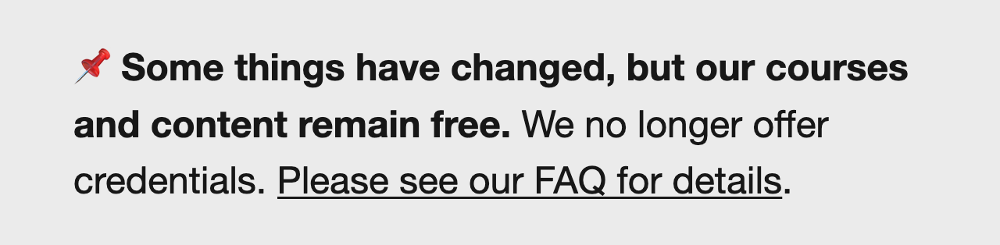

## Post launch recap

Notes:

---

### down time minimal<!-- .element: class="hide" -->

minimum down time

Notes:

---

### clear skies<!-- .element: class="hide" -->

running seamlessly since launch

Notes:

---

### 0 tickets<!-- .element: class="hide" -->

zero support tickets

Notes:

---

### no issues<!-- .element: class="hide" -->

no visual or technical problems

Notes:

---

## And that’s how we did it.

Notes:
(maybe show banner next). oh wait, I meant to show you the banner.

---

<!-- .slide: data-background="black" class="" -->

## Site banner

Notes:
- Used for sitewide notifications, we handle this similar to the footer - by embedding the entirety of it within the JSON.
- this is updated in real time without redeploying the LMS
-

---

<!-- .slide: data-auto-animate -->

<h2 data-id="code-title">Site banner YAML</h2>
<pre class="code-wrapper" data-id="code-animation">
  <code class="language-yml"
    data-line-numbers=""
    data-trim
    data-url="code-samples/banner.yaml"
    ></code>
</pre>

Notes:
(note to self: this is another potential teaser about the conclusion)

---

<!-- .slide: data-auto-animate -->

<h2 data-id="code-title">Site banner HTML</h2>
<pre class="code-wrapper" data-id="code-animation">
  <code class="language-html"
    data-line-numbers=""
    data-trim
    data-url="code-samples/banner.html"
    ></code>
</pre>

Notes:
(note to self: this is another potential teaser about the conclusion)

---

<!-- .slide: data-background="black" class="" -->

### Site banner

<!-- .element: class="r-fit-text" data-id="screencap" -->

Notes:
- read banner out loud
- some of you may be wondering why this messaging is up on our site
