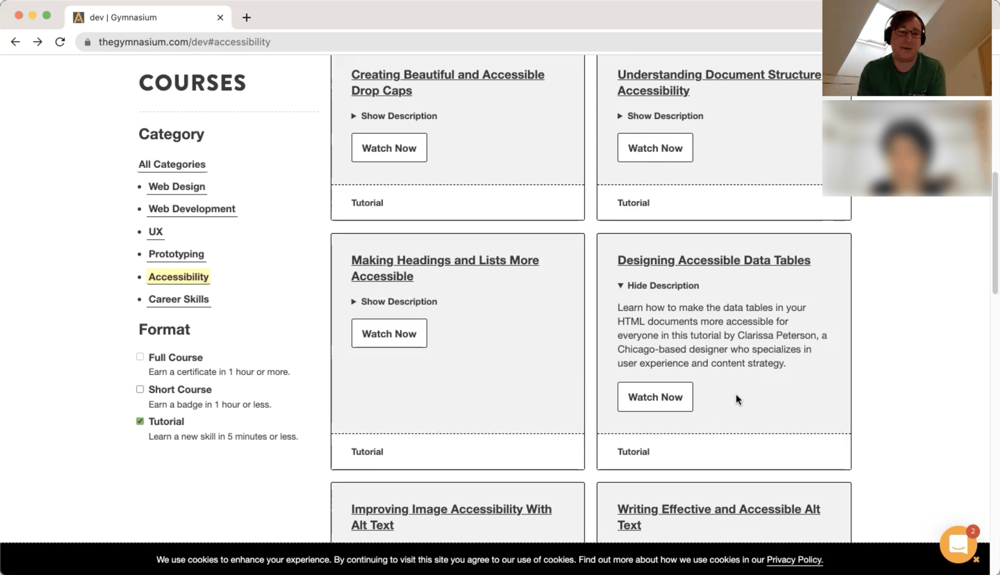
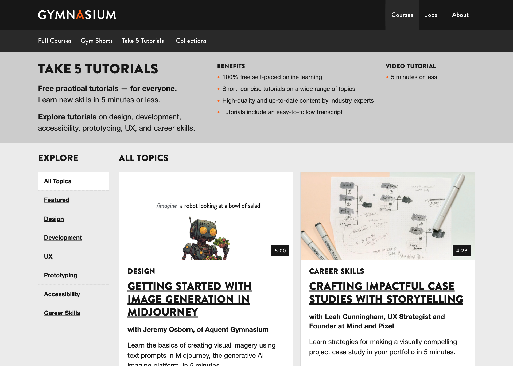
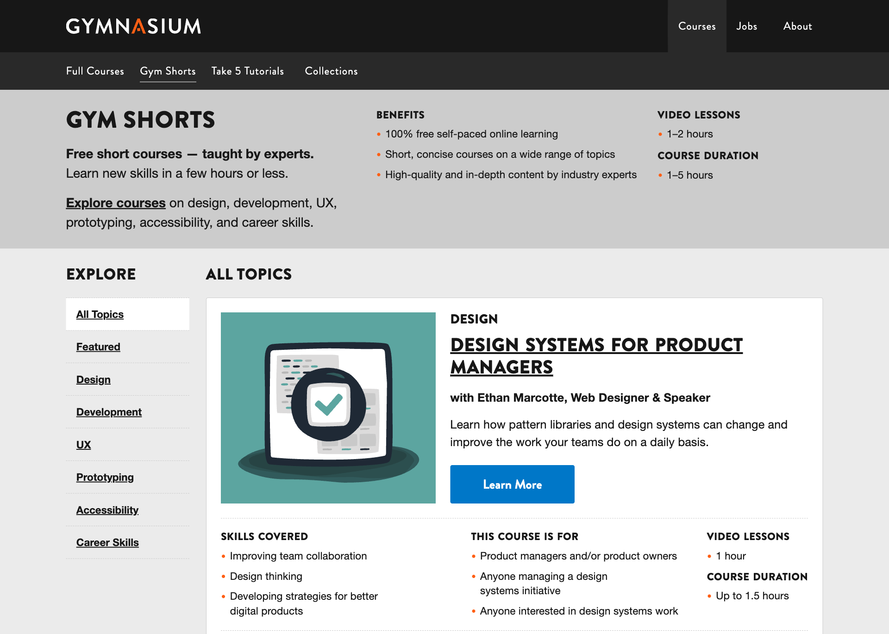

## Catalog

Notes:
- talk about our customized course catalog

---

### Course YAML

<pre class="code-wrapper" data-id="code-animation">
  <code class="language-yml"
    data-line-numbers=""
    data-trim
    data-url="code-samples/GYM-5017.yml"
  ></code>
</pre>

Notes:
- we used individual YAML for each course to generate our course catalog

---

### catalog prototype<!-- .element: class="hide" -->

Notes:
- Soft-redesign presented the opportunity to take our previous UX research
- Took findings and rolled them out
- Faster iteration

---

### Catalog UX research<!-- .element: class="hide" -->

Notes:
- Soft-redesign presented the opportunity to take our previous UX research
- Took findings and rolled them out
- Faster iteration

---

### Tutorials detail<!-- .element: class="hide" -->

Notes:
- Faster iteration
- what we put into production

---

### Course catalog: Tutorials<!-- .element: class="hide" -->

Notes:
- putting it together

### Course catalog: Gym Shorts<!-- .element: class="hide" -->

Notes:
- putting it together

### Course catalog: Full Courses<!-- .element: class="hide" -->

Notes:
- putting it together
