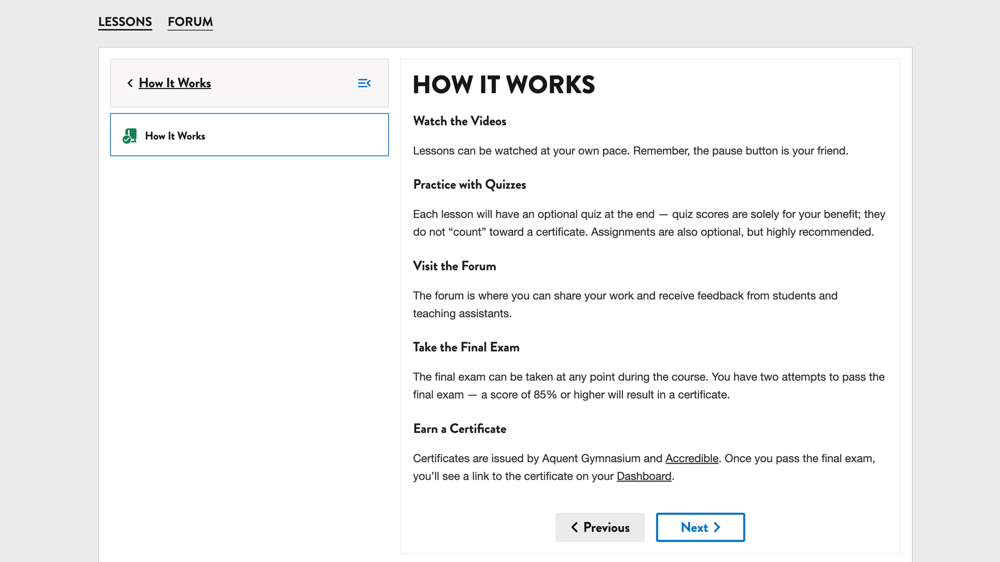

## Courseware

Notes:
- let's demo our courseware transformation

------

#### Hawthorn course navigation

------

#### Hawthorn syllabus

Notes:
- this syllabus is actually an "overloaded" updates section - one of the many hacks we did (this is before you could add a custom page)

---

### All in for MFEs

Notes:
- open edx already had all the features we needed in MFEs
- remove features using the comprehensive theme (aka, the old LMS theme), ie disabled bookmarks

------

#### using courseware for syllabus <!-- .element: class="hide" -->

Notes:
- 

------

#### before <!-- .element: class="hide" -->

Notes:
- 2 enroll CTAs in learning MFE - can start the course without being enrolled in it

------

Notes:
- after our visual updates
- concluding thoughts about courseware updates
