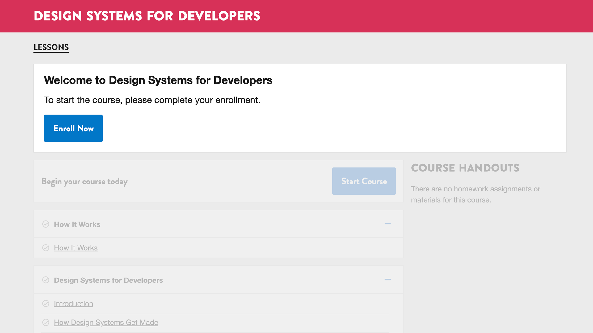

## Courseware

---

## Syllabus in course nav

---

## Syllabus page

---

### All in for MFEs

Notes:
- open edx already had all the features we needed in MFEs
- remove features using the comprehensive theme (aka, the old LMS theme), ie disabled bookmarks

---

## courseware for syllabus

to do: show detail of how it works

---

---

---

---

---

to do: Conclude courseware stuff