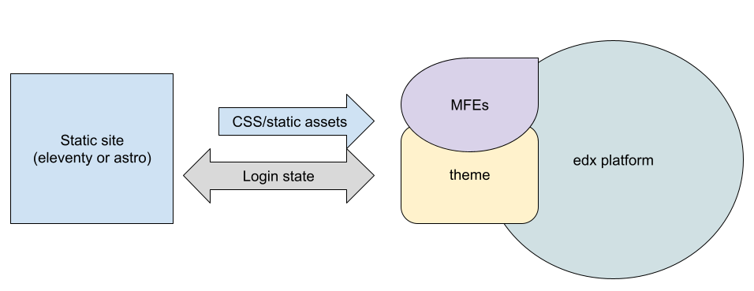

## Why we chose eleventy

Notes:
Why we chose a SSG, and why we chose eleventy
- rapid prototyping and deployment
- design leading development

---

## Architectural Goal Flowchart

Notes:

---

## Deployment Process Overview

- Process is streamlined and reduces the dependency/intervention from the hosting provider. 
- We make changes in the SSG, deploy that (2-5 minutes)
- Trigger a rebuild of the open edx systems (35-45 minutes)

Notes:
We are the ideal client for hosting providers - the only intervention hosting providers needed was to handle emergencies.

---