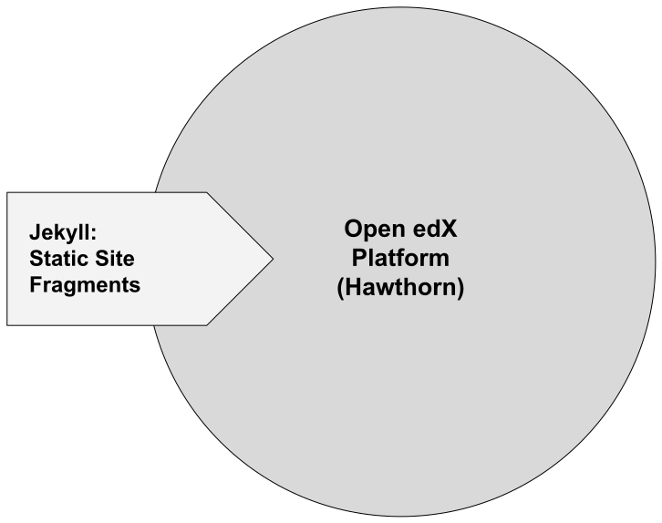

### Choosing Eleventy

Notes:
Why we chose a SSG for our marketing site, and why we chose eleventy
- rapid prototyping and deployment

------

### Hawthorn architecture<!-- .element: class="hide" -->

Notes:
- a simplified view of where we started
- hawthorn based architecture

------

## ⏱️ Performance

Notes:
- let’s talk numbers

------

#### long deploy <!-- .element: class="hide" -->

30–45 minutes to deploy a new page

Notes:
- creating a marketing page took a long time to deploy
- needed our host to create the page in the open edx configs
- not independent
- asking our parents permission to play

------

#### fast deploy <!-- .element: class="hide" -->

~~30–45 minutes to deploy a new page~~ 
2–3 minutes to deploy a new page

Notes:
- After, using eleventy, deploying by ourselves

