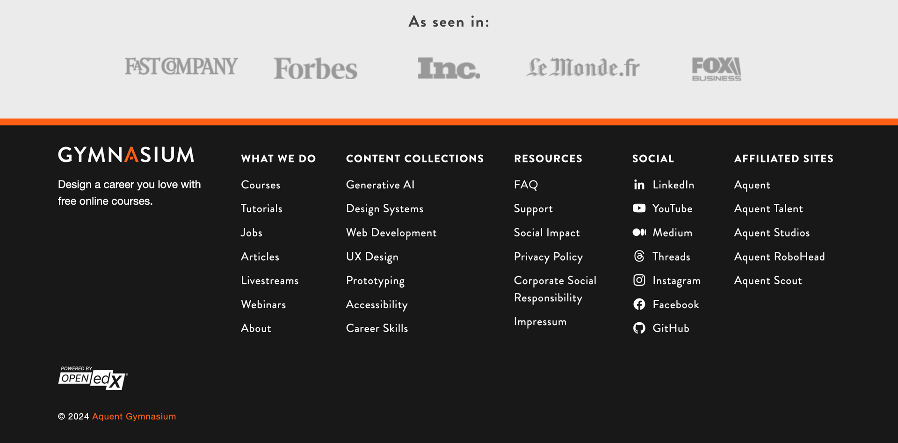
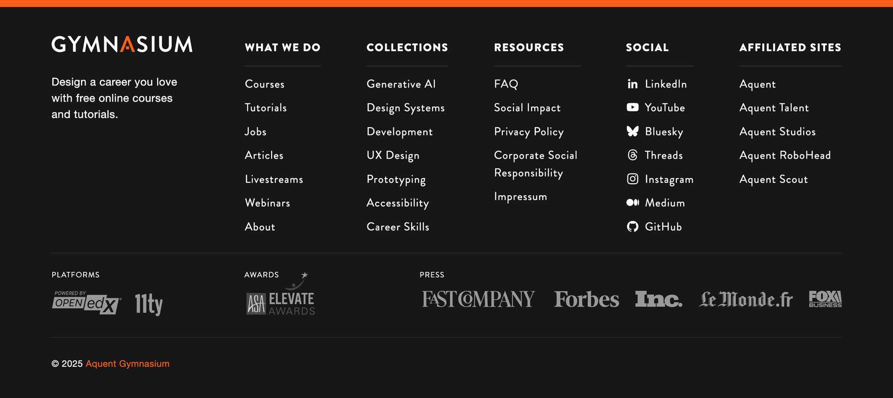

### Footer

Notes:
- let’s showcase our site footer

------

<!-- .element: class="r-fit-text" data-id="screencap" -->

Notes:
- here’s a screencap of our cute footer

------

<!-- .slide: data-auto-animate -->

#### Footer YAML <!-- .element: data-id="code-title" -->

<pre class="code-wrapper" data-id="code-animation">
  <code class="language-yml"
    data-disable- line-numbers="|2-22|23-38|39-57|58-114|115-136|138-151|152-159|160-191"
    data-trim
    data-url="code-samples/footer.yaml"
    ></code>
</pre>

Notes:
- the YAML for our site footer.
- Our footer YAML is processed a little differently - we generate all the HTML for the footer first, then embed the entirety of the HTML inside the JSON. This escaped HTML gets included in the MFEs + theme at build time.

------

#### Footer HTML <!-- .element: data-id="code-title" -->

<pre class="code-wrapper" data-id="code-animation">
  <code class="language-html"
    data-line-numbers=""
    data-trim
    data-url="code-samples/footer.html"
    ></code>
</pre>

Notes:

------

<!-- .slide: data-auto-animate -->

#### Footer JSON

<pre class="code-wrapper" data-id="code-animation">
  <code class="language-json"
    data-line-numbers=""
    data-trim
    data-url="code-samples/footer.json"
    ></code>
</pre>

Notes: Here is the escaped HTML embedded in the JSON

------

<!-- .slide:  -->

#### Before

<!-- .element: class="r-fit-text" data-id="screencap" -->

Notes:
- the hawthorn footer
- did a "soft" redesign

------

#### After

<!-- .element: class="r-fit-text" data-id="screencap" -->

Notes:
- The unified site footer - this looks the same across the eleventy static site and the MFEs
- The only difference is the links in the MFE/theme version point back to the static site
- no need for "state" awareness
