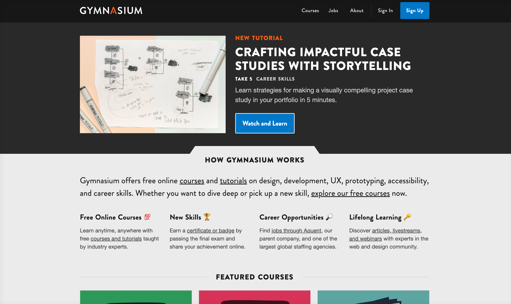
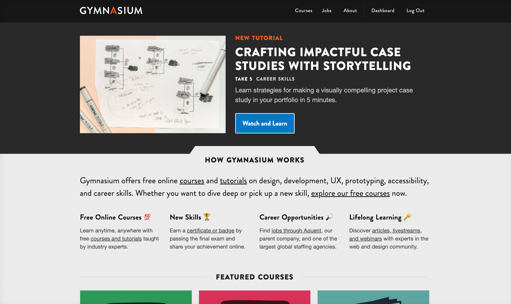
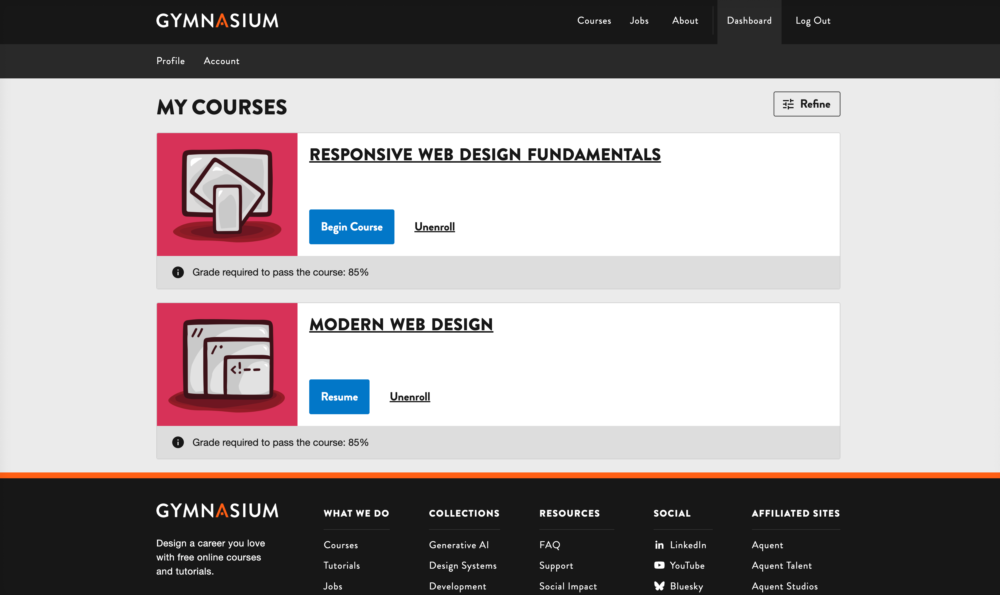
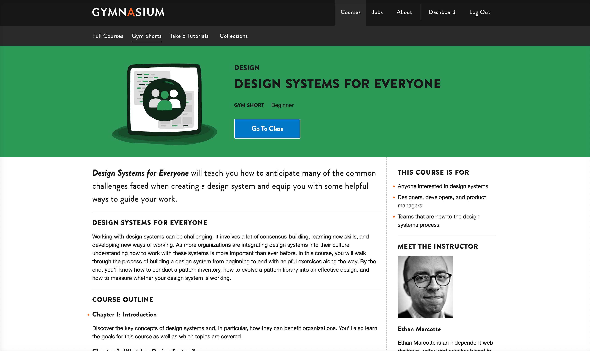

### Navigation

Notes:

---

Notes:
- here’s a zoomed in view of our main nav

---

<!-- .slide: data-auto-animate -->

#### Navigation YAML<!-- .element: data-id="code-title" -->

<pre class="code-wrapper" data-id="code-animation">
  <code class="language-yml"
    data-line-numbers="|3-9|11-16|17-21|22-30"
    data-trim
    data-url="code-samples/nav.yaml"
  ></code>
</pre>

Notes:
[to do:simplify notes]
Here’s an example of the YAML that governs our navigation.
In this example, I’ll step through the various sections of YAML, each of which will get processed and transformed.

------

<!-- .slide: data-auto-animate -->

### Navigation JSON<!-- .element: data-id="code-title" -->

<pre class="code-wrapper" data-id="code-animation">
  <code class="language-json"
    data-line-numbers="|3-16|18-28|29-38|40-57"
    data-trim
    data-url="code-samples/nav.json"
    ></code>
</pre>

Notes:
[to do:simplify notes]
The YAML gets processed by eleventy, which spits out the JSON. Take note that the GYM_ROOT_URL and GYM_LMS_URL text strings have been replaced by the actual URL. We did this to support our development, staging, and production environments.

This JSON is consumed by the MFEs + LMS at build time.

------

<!-- .slide: data-auto-animate -->

#### Navigation: Public

<!-- .element: class="r-fit-text" data-id="screencap" -->

Notes:
The home page for public visitors.

------

<!-- .slide:  -->

#### Navigation: Logged-In

<!-- .element: class="r-fit-text" data-id="screencap" -->

Notes:
The home page for logged in users.

------

<!-- .slide:  -->

#### Navigation: Dashboard

<!-- .element: class="r-fit-text" data-id="screencap" -->

Notes:
The dashboard navigation.

------

<!-- .slide:  -->

#### Navigation: Course

<!-- .element: class="r-fit-text" data-id="screencap" -->

Notes:
The course navigation (in this case, Gym Shorts)
