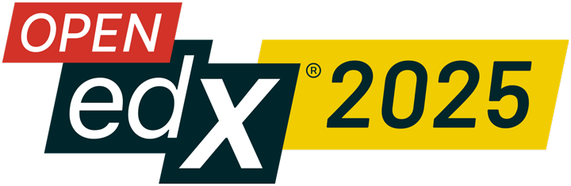
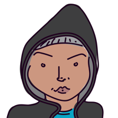
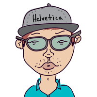
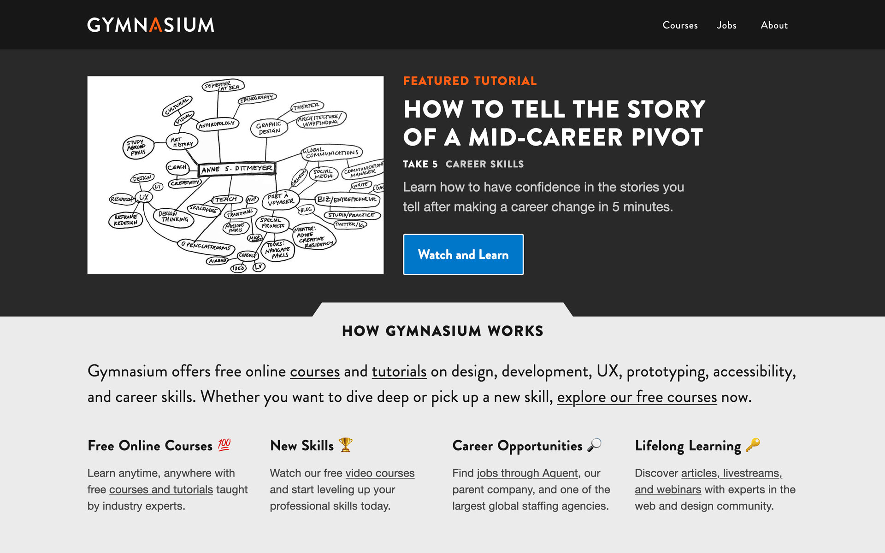
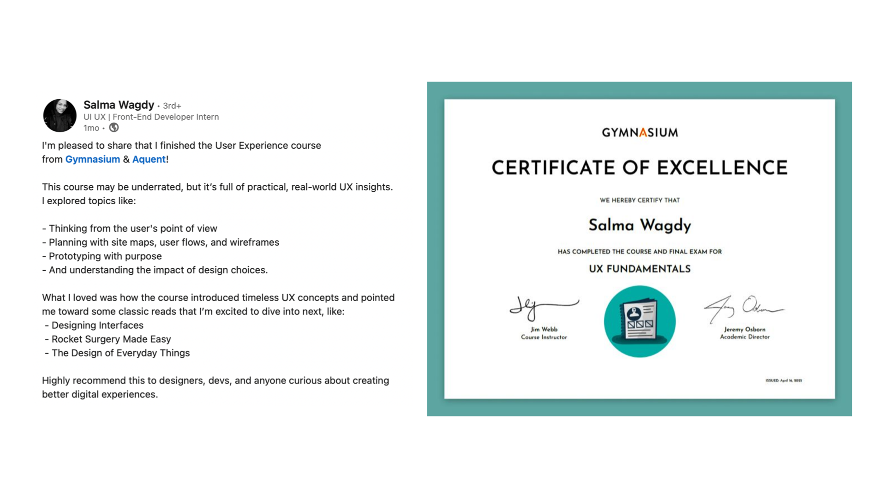
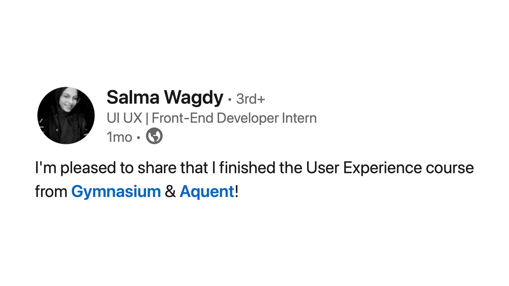
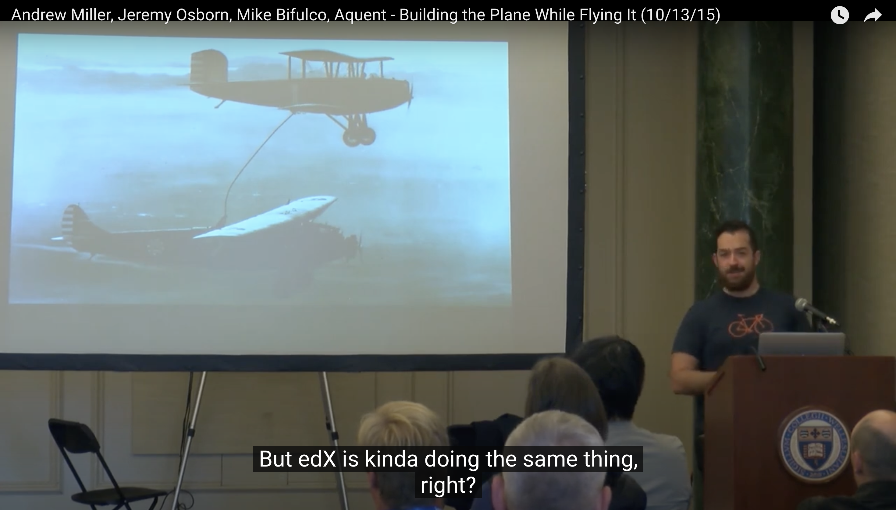

`Case Study Talk`

# Seemingly Seamless

**How We Improved the Learner Experience and Made Our Lives Easier**

with Roman Edirisinghe and Justin Gagne

<!-- .element: class="openedx-logo" -->

Notes:
Bonjour, Ahoj, Hello!
Thank you for joining us for our case study talk, Seemingly Seamless: How We Improved the Learner Experience and Made Our Lives Easier.

---

### Hi, I’m Roman<!-- .element: class="hide" -->

Roman Edirisinghe, Director of Technology

🇷🇺 🇱🇰 🇩🇪 🇺🇸

Notes:
- I’m Roman Edirisinghe, Director of Technology which is essentially a full stack developer

------

### joined team in 2021<!-- .element: class="hide" -->

joined Gymnasium in 2021

Notes:
- no prior experience with Open edX before 2021, only a little bit of Python
- What ensued was a crash course not just into Open edX, but also into how the Gymnasium team had customized the platform

------

### since ’96<!-- .element: class="hide" -->

working with the web since 1996

Notes:
- I started working on the web in 1996

------

### art background<!-- .element: class="hide" -->

background in art

Notes:
- I have a background in art, not computer science

------

### self-taught<!-- .element: class="hide" -->

largely self-taught

Notes:
- maybe not unusual these days, but I’m largely self taught with regard to the web
- could mean there are different (or better) ways to do what we did

---

### Hi, I’m Justin Gagne<!-- .element: class="hide" -->

Justin Gagne, Design Lead

🎨 👨‍💻 ✍️

Notes:
- Justin Gagne, Gymnasium’s design lead

------

### circa 2015 <!-- .element: class="hide" -->

joined Gymnasium in 2015

Notes:
- joined Gymnasium in 2015
- brought in to migrate to open to Open edX and stayed on after

------

### circa 1998 <!-- .element: class="hide" -->

working with the web circa 1998 

Notes:
- while at art school

------

### hybrid <!-- .element: class="hide" -->

designer-developer hybrid

Notes:
- with an emphasis on inclusion and accessibility

------

### lecturer <!-- .element: class="hide" -->

currently a lecturer at the University of Creative Communication in Prague

---

## 👋 We’re Gymnasium

Notes:
- We’re Gymnasium — Aquent’s free online learning platform.
- FYI, if you don't know Aquent, it's a global staffing agency

------

### Gymnasium homepage<!-- .element: class="hide" -->

Notes:
- Together, we built Gymnasium — its marketing site and Open edX learner experience
- example of the current home page above the fold
- design language, clean simple, etc

Read from screen? Or use the following:
- as you can see, we offer free online courses and tutorials
- topics: design, development, UX, prototyping, accessibility, and career skills

---

## Since 2013

------

### 160,000 students<!-- .element: class="hide" -->

reached over 160,000 students

Notes:
- one hundred and sixty thousand students

------

### 200+ countries and regions<!-- .element: class="hide" -->

more than 200 countries and regions

Notes:
- more than 200 countries and regions

------

### 20,000 credentials<!-- .element: class="hide" -->

issued over 20,000 credentials

Notes:
- over twenty thousand credentials

---

## Empowerment

Notes:
- preaching to the choir but...
- new skills often lead to empowerment

------

### LinkedIn Cert <!-- .element: class="hide" -->

Notes:
- student example:
- Salma, intern in Egypt showing off her achievement on LinkedIn

---

### LinkedIn Cert Zoom <!-- .element: class="hide" -->

Notes:
Congrats to Salma!

---

## Why we’re here

Notes:
- why are we here?

------

### 👀 This talk is for…

anyone integrating Open edX with a separate marketing site

Notes:
- 

------

### 🔍 What we did

- Upgraded from Hawthorn to Redwood
- Separated marketing site and learning platform
- Unified the UX with a seamless, login-aware experience
- Refreshed the course catalog and core components
- Customized MFEs using YAML and JSON for flexibility

Notes:
(read from screen)

Show of hands regarding MFEs?
YAML? JSON?

------

### 🥳 What happened? 

- Seamless Open edX customization
- Redesign of marketing site and LMS
- Zero support tickets 

Notes:
- successful outcome: zero support tickets post launch

---

## Rooted in customization

Notes:
- a quick timeline of our history

------

### 2013 → launch<!-- .element: class="hide" -->

2013 → initial launch on a custom-built platform

------

### 2015 → relaunch<!-- .element: class="hide" -->

2015 → relaunch on Open edX 😲

Notes: We were featured in an Open edX Conference talk entitled "Building the Plane While Flying it"

------

### Building the Plane Slide<!-- .element: class="hide" -->

Notes:
Our talk today is somewhat a continuation of the previous presentation, a decade later. All civilization is built on the shoulders of giants.

------

### 2018 → hawthorn<!-- .element: class="hide" -->

2018 → upgrade to Hawthorn

Notes: (and time stood still)
no pop quizzes, just exceptional performance

------

### 2025 → redwood<!-- .element: class="hide" -->

2025 → upgrade to Redwood

Notes:
10 versions in 10 hours (with a lot planning)

------

### 2025 stuff<!-- .element: class="hide" -->

2025 → 🔮 🎱 🥠 twists, turns, and…

Notes:
⚠️ 🚧 🔥

------

### stick around<!-- .element: class="hide" -->

stick around 🙏 (it’ll be worth it)

---

## Enough... <!-- .element: class="hide" -->

Notes:
Enough — time to get lost in the Open edX forest (and maybe into the weeds later).
