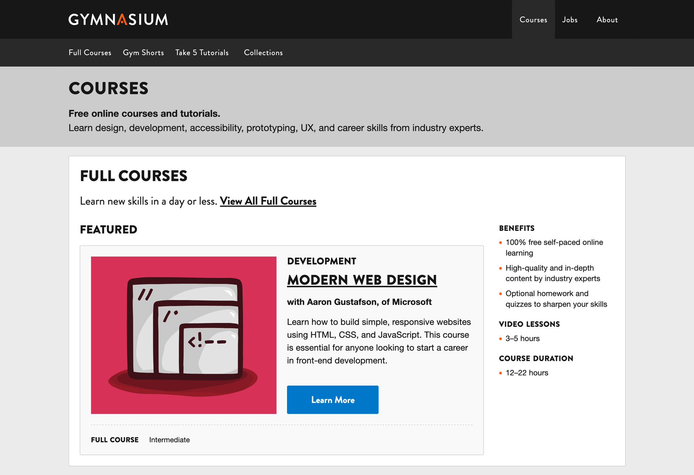

<!-- .slide: data-background="black" -->
## Seemingly Seamless: How We Improved the Learner Experience and Made Our Lives Easier

with **Roman Edirisinghe** and **Justin Gagne**

`Open edX 2025`

Note:

Thank you for joining us for our case study talk, Seemingly Seamless: How We Improved the Learner Experience and Made Our Lives Easier.

I’m Roman Edirisinghe, Director of Technology. And I’m Justin Gagne, Design Lead.

---

## 👋 We’re Gymnasium

Note:

Bonjour, Ahoj, Hello — we're Gymnasium — Aquent’s free learning platform.

Together, we built Gymnasium — it’s marketing site and Open edX learner experience.

---

## About Gymnasium

We offer free online courses and tutorials on design, development, UX, prototyping, accessibility, and career skills. <!-- .element: class="fragment" data-fragment-index="1" -->

Since 2013, we’ve welcomed over 160,000 students from more than 200 countries and regions, and over 20,000 of them have earned credentials. <!-- .element: class="fragment" data-fragment-index="1" -->

For many students, these credentials — certificates and badges — significantly increase their chances of landing a job. <!-- .element: class="fragment" data-fragment-index="1" -->

---

## New Skills

Note:

Our students frequently share their achievements on LinkedIn, showcasing the skills they’ve built through Gymnasium.

---

## Empowerment

Note:

New skills often lead to empowerment. Seeing an intern like Salma in Egypt upskilling is just one of over 20,000 stories that make free online learning meaningful — thanks to Gymnasium and made possible by our parent company, Aquent. Congrats to Salma!

Enough about us, let’s talk about Open edX.

---

## Roots to Redwood

- **2013:** Gymnasium launches on a custom-built platform with one, then two courses <!-- .element: class="fragment" data-fragment-index="1" -->
- **2015:** Gymnasium relaunches on Open edX (featured in Open edX Conference talk) <!-- .element: class="fragment" data-fragment-index="1" -->
- **2018:** Migration to Hawthorn; no pop quizzes, just exceptional performance <!-- .element: class="fragment" data-fragment-index="1" -->
- **2024**: Migration from Hawthorn to Redwood; 10 years in 10 hours <!-- .element: class="fragment" data-fragment-index="1" -->
- **2025:** 🔮 🎱 🥠 Twists, turns, and a big reveal… *Stick around.* 🙏 <!-- .element: class="fragment" data-fragment-index="1" -->

Note:

What started as a custom-built platform grew into something much bigger and better, thanks to Open edX. This brief timeline highlights the key migrations and milestones that shaped Gymnasium — and shaped my approach to design and development along the way.

---

## Open edX Course Offerings

**2015:**

- 5 Full Courses
- 3 Short Courses <!-- .element: class="fragment" data-fragment-index="1" -->

**2025:**

- 10 Full Courses (6 live, 4 retired)
- 19 Short Courses (15 live, 4 retired)
- 61 Tutorials (60 live, 1 retired)
- 1 Workshop (2024 pilot with a small cohort in real-time) <!-- .element: class="fragment" data-fragment-index="1" -->

Note:

Since 2015, Gymnasium’s course catalog has expanded, not just in quantity, but also in topic and format. Retired courses remain accessible to learners, while new formats like our 5-minute tutorials and the one-off portfolio workshop pilot helped meet diverse learning needs.

---

<!-- .slide: data-background="teal" class="r-stack" -->
## Acronyms, part 1

CMS **: Content Management System**<!-- .element: class="fragment" data-fragment-index="1" -->

CSS **: Cascading Style Sheets**<!-- .element: class="fragment" data-fragment-index="1" -->

HTML **: Hypertext Markup Language**<!-- .element: class="fragment" data-fragment-index="1" -->

JS **: JavaScript** <!-- .element: class="fragment" data-fragment-index="1" -->

JSON **: JavaScript Object Notation** <!-- .element: class="fragment" data-fragment-index="1" -->

LMS **: Learning Management System** <!-- .element: class="fragment" data-fragment-index="1" -->

MFE **: Micro Front-End**<!-- .element: class="fragment" data-fragment-index="1" -->

Note:
Before we go any further, we need to introduce you to some acronyms used throughout this presentation. There will be a pop quiz at the end.

---

<!-- .slide: data-background="teal" class="r-stack" -->
## Acronyms, part 2

SASS **: (Syntactically Awesome Style Sheets)** <!-- .element: class="fragment" data-fragment-index="1" -->

SCSS **: (Sassy CSS)**<!-- .element: class="fragment" data-fragment-index="1" -->

SSG **: Static Site Generator**<!-- .element: class="fragment" data-fragment-index="1" -->

UI **: User Interface** <!-- .element: class="fragment" data-fragment-index="1" -->

UX **: User Experience** <!-- .element: class="fragment" data-fragment-index="1" -->

YAML **: YAML Ain't Markup Language**<!-- .element: class="fragment" data-fragment-index="1" -->

WTF **: Welcome to France**<!-- .element: class="fragment" data-fragment-index="1" -->

Notes:
YAML was originally named Yet Another Markup Language but was later renamed to recursive acronym YAML Ain't Markup Language

---
