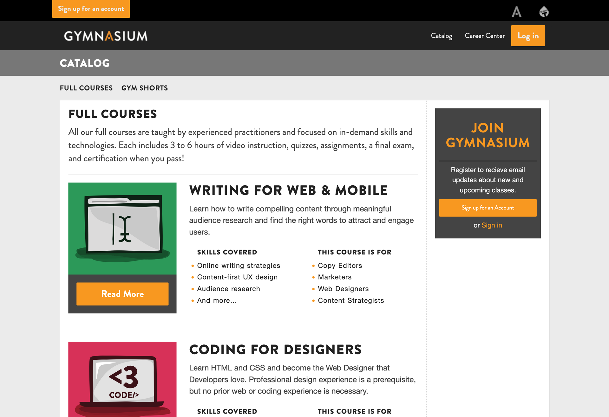

<!-- .slide: data-background="black" -->
## Seemingly Seamless
### How We Improved the Learner Experience and Made Our Lives Easier

with **Roman Edirisinghe** and **Justin Gagne**

`Open edX 2025`

Notes:

Thank you for joining us for our case study talk, Seemingly Seamless: How We Improved the Learner Experience and Made Our Lives Easier.

I’m Roman Edirisinghe, Director of Technology. And I’m Justin Gagne, Design Lead.

------

Why are we here?

------

- We customized Open edX for a unified, branded experience.
- We overcame styling, asset, and content challenges.
- Design needs shaped our tech choices, like using Eleventy.
- We unified the course catalog and login flow.
- We dealt with MFE issues, weak docs, and tricky integrations.
- We’ll show our YAML/JSON setup and theme customizations.

Notes:

------

this talk is about customizing open edx

We will take you through our history with open edx, and show you where we ended up.

Along the way, we ran into many pitfalls, least of which was our desire for maximum customization.

Notes:

---

## 👋 We’re Gymnasium


Notes:

Bonjour, Ahoj, Hello — we're Gymnasium — Aquent’s free learning platform.

Together, we built Gymnasium — it’s marketing site and Open edX learner experience.


---

## About Gymnasium

We offer free online courses and tutorials on design, development, UX, prototyping, accessibility, and career skills.

Since 2013, we’ve welcomed over 160,000 students from more than 200 countries and regions, and over 20,000 of them have earned credentials.<!-- .element: class="fragment" data-fragment-index="1" -->

For many students, these credentials — certificates and badges — significantly increase their chances of landing a job.<!-- .element: class="fragment" data-fragment-index="2" -->

Notes:

---

## New Skills


Notes:
Our students frequently share their achievements on LinkedIn, showcasing the skills they’ve built through Gymnasium.

---


## Empowerment


Notes:

New skills often lead to empowerment. Seeing an intern like Salma in Egypt upskilling is just one of over 20,000 stories that make free online learning meaningful — thanks to Gymnasium and made possible by our parent company, Aquent. Congrats to Salma!

Enough about us, let’s talk about Open edX.


---

## Course Offerings: 2015

- 5 Full Courses
- 3 Short Courses

Notes:

Since 2015, Gymnasium’s course catalog has expanded, not just in quantity, but also in topic and format. Retired courses remain accessible to learners, while new formats like our 5-minute tutorials and the one-off portfolio workshop pilot helped meet diverse learning needs.

------



---

## Course Offerings: 2025

- 10 Full Courses (6 live, 4 retired)
- 19 Short Courses (15 live, 4 retired)
- 61 Tutorials (60 live, 1 retired)
- 1 Workshop (2024 pilot with a small cohort in real-time)

------


---

<!-- .slide: data-background="black" data-background-image="https://www.publicdomainpictures.net/pictures/80000/velka/giant-redwood-trees-in-california-1392245948kXD.jpg" class="has-dark-background" -->

## Our Open edX Journey <!-- .element: class="text-shadow" -->

---

## Roots to Redwood

- 2013: Gymnasium launches on a custom-built platform with one, then two courses
- 2015: Gymnasium relaunches on Open edX (featured in Open edX Conference talk) <!-- .element: class="fragment" data-fragment-index="2" -->
- 2018: Migration to Hawthorn; no pop quizzes, just exceptional performance <!-- .element: class="fragment" data-fragment-index="3" -->
- 2024: Migration from Hawthorn to Redwood; 10 years in 10 hours <!-- .element: class="fragment" data-fragment-index="4" -->
- 2025: 🔮 🎱 🥠 Twists, turns, and a big reveal… Stick around. 🙏 <!-- .element: class="fragment" data-fragment-index="5" -->

<!-- Demo: if we want to fine tune the animations and text with additional bolding/italics
```
<ul>
  <li class="fragment" data-fragment-index="0">2013: Gymnasium launches on a custom-built platform with one, then two course</li>
  <li class="fragment" data-fragment-index="1">2015: Gymnasium relaunches on Open edX (featured in Open edX Conference talk)</li>
  <li class="fragment" data-fragment-index="2">2018: Migration to Hawthorn; no pop quizzes, just exceptional performance</li>
  <li class="fragment" data-fragment-index="3">2024: Migration from Hawthorn to Redwood; 10 years in 10 hours</li>
  <li class="fragment" data-fragment-index="4">2025: 🔮 🎱 🥠 Twists, turns, and a big reveal… Stick around. 🙏</li>
</ul>

``` -->

Notes:
What started as a custom-built platform grew into something much bigger and better, thanks to Open edX. This brief timeline highlights the key migrations and milestones that shaped Gymnasium — and shaped my approach to design and development along the way.


---

<!-- .slide: data-background="teal" class="r-stack" -->

## Core Curriculum


- CSS<span>: Cascading Style Sheets</span><!-- .element: class="fragment" data-fragment-index="1" -->

- HTML<span>: Hypertext Markup Language</span><!-- .element: class="fragment" data-fragment-index="1" -->

- JS<span>: JavaScript</span> <!-- .element: class="fragment" data-fragment-index="1" -->

Notes:
If you're not familiar with these terms, these are the building blocks of the web.
- CSS paints the web
- HTML provides the framework/skeleton.
- JavaScript creates interactivity.

---

<!-- .slide: data-background="teal" class="r-stack" -->

## Vocabulary

- CMS<span>: Content Management System</span><!-- .element: class="fragment" data-fragment-index="1" -->

- JSON<span>: JavaScript Object Notation</span> <!-- .element: class="fragment" data-fragment-index="1" -->

- LMS<span>: Learning Management System</span> <!-- .element: class="fragment" data-fragment-index="1" -->

- MFE<span>: Micro Front-End</span><!-- .element: class="fragment" data-fragment-index="1" -->

- SSG<span>: Static Site Generator</span><!-- .element: class="fragment" data-fragment-index="1" -->

- YAML<span>: YAML Ain't Markup Language</span><!-- .element: class="fragment" data-fragment-index="1" -->


<!--- WTF<span>: Welcome to France</span> -->


Notes:
For accessibility reasons, we'd 

Before we go any further, we need to introduce you to some acronyms used throughout this presentation. There will be a pop quiz at the end.

YAML was originally named Yet Another Markup Language but was later renamed to recursive acronym YAML Ain't Markup Language

---