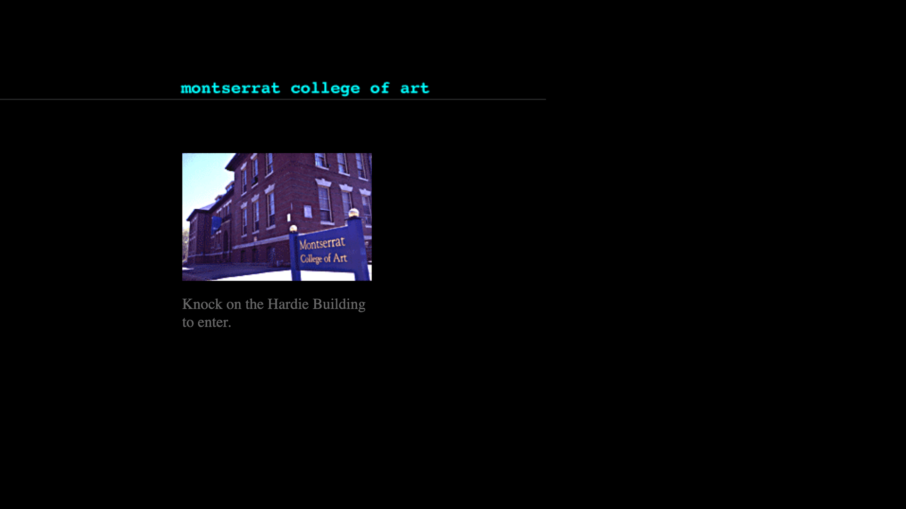

## Hi, I’m Justin Gagne

Design Lead 🎨 👨‍💻 ✍️ <!-- .element: class="fragment" data-fragment-index="1" -->

Note:
I’m Justin Gagne, and I’m Gymnasium’s design lead. I joined Gymnasium in 2015, and started my journey with Open edX.

---

### Artist <!-- .element: class="hide" -->

---

### Art School <!-- .element: class="hide" -->

Note:
Montserrat College of Art’s website circa 1996 designed by John McVey.

---

## View Source (Circa 1998)

- Designer-developer hybrid with an emphasis on inclusion and accessibility <!-- .element: class="fragment" data-fragment-index="1" -->
- Over 20 years of teaching design in higher ed <!-- .element: class="fragment" data-fragment-index="2" -->
- Currently a lecturer at the University of Creative Communication in Prague <!-- .element: class="fragment" data-fragment-index="3" -->

Note:
I started working with the web circa 1998 while at art school.
