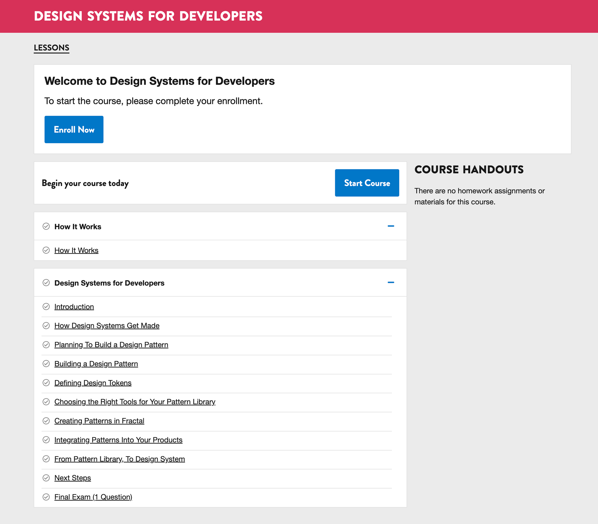
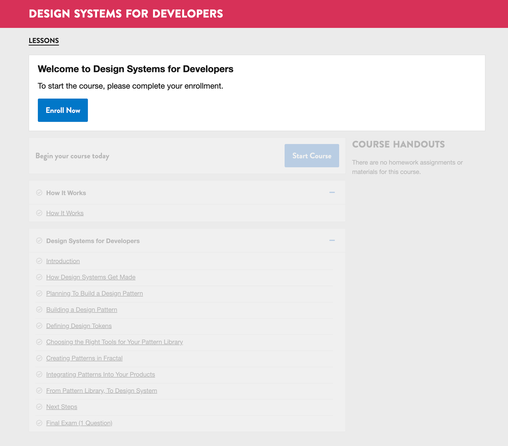
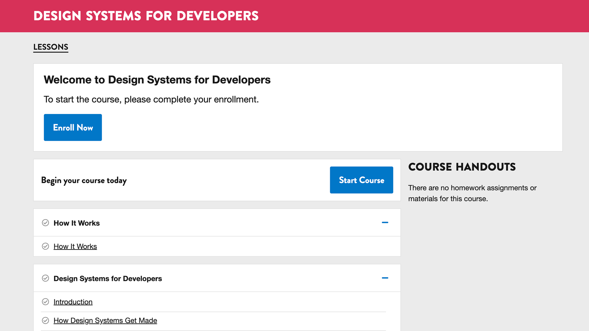
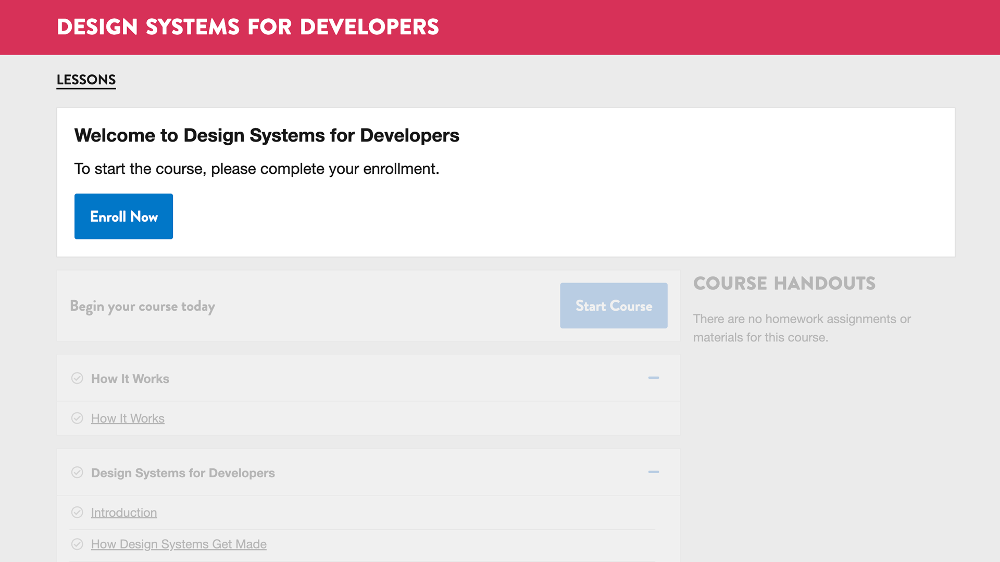

<!-- .slide: data-background="black" -->
## Design-Development Philosophy

- The journey to a seamless learner experience began in summer 2015.
- Transitioning to Open edX brought design and development in-house.
- I led design while prototyping in HTML/CSS to streamline collaboration.
- Our small, five-person team worked collaboratively across roles.
- My role focused on the visual front end, enabling developers to concentrate on core platform work.

Note:
The journey toward a seemingly seamless learner experience started in the summer of 2015.

Originally, I had ghostwritten a course and worked as a teaching assistant.

When we migrated from a custom LMS to Open edX, the design and development process became in-house, with Mike Bifulco as “The Engineering Team” and myself as “The Design Team.” I prototyped directly in HTML and CSS, helping make the design and development workflow more seamless.

It was a small team of five: each doing distinct work, rarely siloed, and often collaborative.

Before I joined as design lead, the visual design was created by a previous team member in Photoshop, producing incredible comps that were later developed into functional code by another teammate.

My involvement freed up the development team to focus on theming and core Open edX development, allowing me to concentrate on the visual, display layer, specifically the front end of the marketing website and Open edX. The result was a more harmonious design and development process with closer collaboration.

---

<!-- .slide: data-background="black" -->
## Easy to Read, Easy to Build, Easy to Learn

> Good design and good markup provide structure to content. Good markup is a fundamental part of good design: beautiful on the inside, beautiful on the outside.
>
> — [Frank Chimero](https://frankchimero.com), from [Designers vs Coding](https://web.archive.org/web/20111201205345/http://blog.frankchimero.com/post/9594863189)

---

## Choosing Tools That Are Seamless

- We migrated our static site generator from Jekyll to Eleventy (11ty)
- We chose Eleventy because it put content and design before development
- We chose a front-end tool that was accessible and extensible

Note:
TK

---

- The original design and development philosophy still guides our work nearly a decade later.
- Open edX—and our approach—has matured over time.
- My philosophy centers on the learner, with design leading development.
- We build with a content-first mindset and human-readable structure.
- I advocate for using core web technologies over frameworks by default.

Note:
Almost 10 years later, that design and development philosophy persisted, in some ways becoming ubiquitous to how we, and I, work.

Open edX has matured, and so have we.

My design and development philosophy is centered around the student, the learner, if you will. With visual and experience design coming before development. Designing a better learner experience is intentional, yes, but it’s also a natural byproduct of the way we build.

That way of building combines a content-first mindset with human-readable data and structure, for people, for robots, and for the tools we rely on.

It means championing core web technologies like HTML, CSS, and JavaScript, not frameworks by default. Frameworks have their place, but the foundation should be written in plain, readable code. Not markup soup.

---

---

---

---

