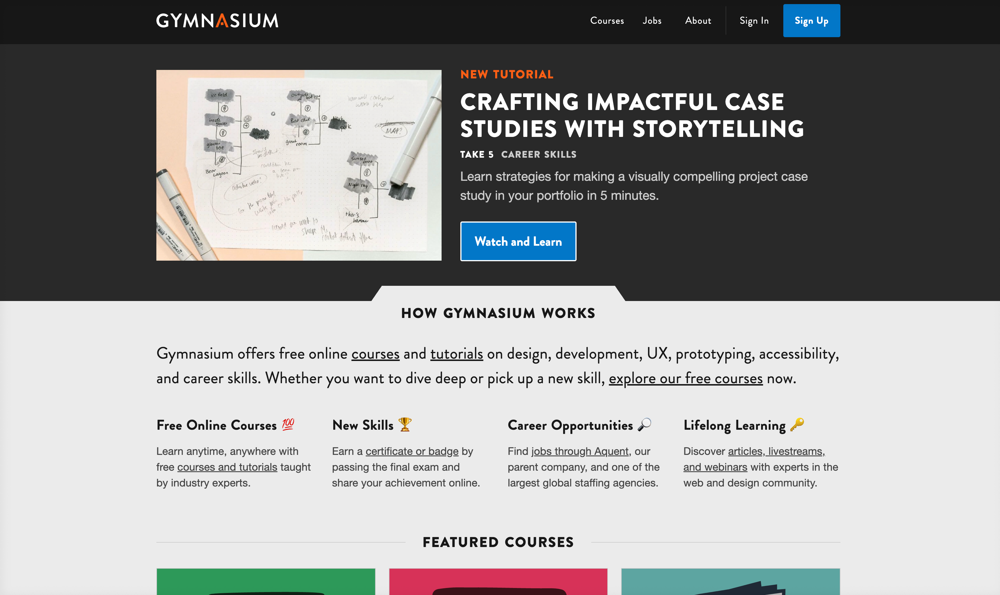

## Hi, I'm Roman

Director of Technology

- working with the web since 1996<!-- .element: class="fragment" data-fragment-index="1" -->
- background in art<!-- .element: class="fragment" data-fragment-index="2" -->
- largely self-taught<!-- .element: class="fragment" data-fragment-index="3" -->

Notes:
I'm Roman Edirisinghe, and I'm Gymnasium’s director of technology. I joined Gymnasium in 2021, and had no prior experience with Open edX.

---

<!-- .slide: data-background="darkslategray" class="r-stack" -->

## Core curriculum

- CSS: Cascading Style Sheets<!-- .element: class="fragment" data-fragment-index="1" -->

- HTML: Hypertext Markup Language<!-- .element: class="fragment" data-fragment-index="1" -->

- JS: JavaScript <!-- .element: class="fragment" data-fragment-index="1" -->

Notes: (Roman)
If you're not familiar with these terms, these are the building blocks of the web. [reveal acronyms]
- CSS paints the web
- HTML provides the framework/skeleton.
- JavaScript creates interactivity.

---

<!-- .slide: data-background="darkslategray" class="r-stack" -->

## Vocabulary

- CMS: Content Management System<!-- .element: class="fragment" data-fragment-index="1" -->

- JSON: JavaScript Object Notation <!-- .element: class="fragment" data-fragment-index="1" -->

- LMS: Learning Management System <!-- .element: class="fragment" data-fragment-index="1" -->

- MFE: Micro Front-End<!-- .element: class="fragment" data-fragment-index="1" -->

- SSG: Static Site Generator<!-- .element: class="fragment" data-fragment-index="1" -->

- YAML: Yet Another Markup Language<!-- .element: class="fragment" data-fragment-index="1" -->

Notes:
Before we go any further, we need to introduce you to some additional acronyms used throughout this presentation. There will be a pop quiz at the end.

[optional]: Also known as YAML Ain't Markup Language

---

## Beginnings

Vanilla Open edX vs Gymnasium's Open edX

- Gymnasium's Hawthorn theme was heavily customized
- Upgrading became a challenge
- "Stuck" on Hawthorn since 2020
- adding new pages required intervention of hosting provider

Notes:
What ensued was a crash course not just into Open edX, but also into how the Gymnasium team had customized the platform.

---

## Recap

Gymnasium's Hawthorn-based custom theme:
- Used a SSG (Jekyll) to include pre-generated HTML fragments within the LMS
- Our marketing site and LMS were effectively one and the same.
- But we still **needed** our hosting provider to generate new pages.
- We were hampered by the limitations of Open edX. [REVISE]

Notes:

If we bored you at the beginning, here's more stuff to help you fall asleep.

---

## Sea Change Woes

Sometimes, partnerships have to change. <!-- .element: class="fragment" data-fragment-index="0" -->

- loveless marriage <!-- .element: class="fragment" data-fragment-index="1" -->
- it's not you, it's me <!-- .element: class="fragment" data-fragment-index="2" -->
- (but it's actually you) <!-- .element: class="fragment" data-fragment-index="3" -->

Notes:
We realized the relationship with our hosting provider was not what it used to be. Our hosting provider had changed hands and it became apparent that they were no longer able to meet our needs.

---

## Change is Inevitable

- Research new hosting providers
- Discovery that an upgrade is necessary
- We knew we were on a sinking ship
- Urgency was paramount
- Change the overall architecture (frontend + LMS)

Notes:

---

## Research Phase

Post Hawthorn Open edX (Olive...Palm)

- MFEs
- Noticed MFEs weren't built consistently
- Confusing implementation - some parts of LMS were the theme, others were MFEs.

Notes:
Started learning the MFEs in 2023/2024 etc.

---

### Plan Overview

1. login "awareness" on static site
1. open edx version upgrade
1. achieving a consistent experience
    - YAML + JSON
    - custom react components
    - CSS served from static site

Notes:
For the sake of simplicity, we are going to skip talking about login awareness and focus on the 

---

## 🍪 <!-- .element: style="font-size: 12rem;" -->

---

## Steps/Process

Why? Updating styles from one source is much easier/faster than updating it in 8 different places.

1. disable built-in MFE CSS
    - cleanup
2. disable theme CSS
3. use eleventy to deliver CSS to MFEs + theme 

Notes:
Among other thinbgs, our goal was to take advantage of our static site's 2 minute build time. Compare that to 35-45 minutes on average for deploying open edx changes.

---

## Why not use Paragon

(for the uninitiated, Paragon is Open edX's design system)

- Well, we are (sort of)
    - we still use Paragon's interactivity (the interactive react components)
    - copied core bits of MFE CSS and customized that
    - in some cases, we eliminated it altogether and wrote our own rules
- Path of least resistance
- we already have our own design language
- easier to push ours forward instead of using the styles built into paragon

---

## Achieving Consistency

- CSS being served from SSG (eleventy)
- Required disabling default CSS of MFEs. 
- Pitfalls: discovery that some development of MFEs resulted in CSS rules declared 8-10x (link to the issue)

Notes:
Let's talk talk about the steps involved in achieving a consistent visual design.

---

### Disable default CSS

Notes:
To achieve a consistent aesthetic, and to take advantage of our static site's 2 minute build time, we decided to serve all the CSS from the static site.

---

## Redwood Upgrade

- Upgrade from Hawthorn (2018) to Redwood (2024)
- Our very talented collaborator Amir Tadrisi wrote some fancy scripts to automatically migrate data from version to version.

Notes:
The next slide shows how many versions Amir needed to process.

------

## Versions

**Hawthorn >** <!-- .element: class="fragment" data-fragment-index="1" --> 
**Ironwood >** <!-- .element: class="fragment" data-fragment-index="2" --> 
**Juniper >** <!-- .element: class="fragment" data-fragment-index="3" --> 
**Koa >** <!-- .element: class="fragment" data-fragment-index="4" --> 
**Lilac >** <!-- .element: class="fragment" data-fragment-index="5" --> 
**Maple >** <!-- .element: class="fragment" data-fragment-index="6" --> 
**Olive >** <!-- .element: class="fragment" data-fragment-index="7" --> 
**Palm >** <!-- .element: class="fragment" data-fragment-index="8" --> 
**Quince >** <!-- .element: class="fragment" data-fragment-index="9" --> 
**Redwood** <!-- .element: class="fragment" data-fragment-index="10" -->

Notes:
Could you imagine going through these manually? We will leave you a QR code to contact Amir should you need his consulting expertise.

------

## Pain = Healing

10 versions in 10 hours, with 10 days of prep & planning.

Notes:
The upgrade was huge pain point, but Amir's help made this step so much easier.

---

## Architectural Goal Flowchart

Notes:

---

## Deployment Process Overview

- Process is streamlined and reduces the dependency/intervention from the hosting provider. 
- We make changes in the SSG, deploy that (2-5 minutes)
- Trigger a rebuild of the open edx systems (35-45 minutes)

Notes:
We are the ideal client for hosting providers - the only intervention hosting providers needed was to handle emergencies.

---

<!-- .slide: data-background="black" class="" -->

## Truth = YAML + JSON <!-- .element: class="r-fit-text" -->

Notes:
YAML/JSON as a source of truth - showing stages of “the truth”.

Some may ask, why not just write your truth in JSON - the answer:  YAML is much easier to read and write, doesn't require curly braces and quotes everywhere.

The second reason, is the JSON is consumed exclusively by the LMS portion of our setup - the MFEs + the theme

------

## YAML

YAML is the maintainer's source of truth.

<pre class="code-wrapper" data-id="code-animation">
  <code class="language-yml" data-line-numbers data-trim> 
%YAML 1.2
---
YAML: YAML Ain't Markup Language™

What It Is:
  YAML is a human-friendly data serialization
  language for all programming languages.
  </code>
</pre>

Notes:

------

## JSON

JSON is exclusively for consumption by the LMS (MFEs + theme)

Notes:

---

<!-- .slide: data-background="black" class="" -->
## Navigation

Notes: Here's an example of the YAML that governs our navigation.

------

<!-- .slide: data-auto-animate -->
<h2 data-id="code-title">Navigation YAML</h2>
<pre class="code-wrapper" data-id="code-animation">
  <code class="language-yml" 
    data-line-numbers="|3-9|11-16|17-21|22-30" 
    data-trim
    data-url="code-samples/nav.yaml"
  ></code>
</pre>

Notes:
In this example, I'll step through the various sections of YAML, each of which will get processed and transformed.

------

<!-- .slide: data-auto-animate -->

## Navigation JSON

<pre class="code-wrapper" data-id="code-animation">
  <code class="language-json"
    data-line-numbers="|3-16|18-28|29-38|40-57"
    data-trim
    data-url="code-samples/nav.json"
    ></code>
</pre>

Notes:
The YAML gets processed by eleventy, which spits out the JSON. Take note that the GYM_ROOT_URL and GYM_LMS_URL text strings have been replaced by the actual URL. We did this to support our development, staging, and production environments.

This JSON is consumed by the MFEs + LMS at build time.

------

<!-- .slide: data-auto-animate -->

### Navigation: Public

<!-- .element: class="r-fit-text" data-id="screencap" -->

Notes:
The home page for public visitors.

------

<!-- .slide:  -->

### Navigation: Logged-In

<!-- .element: class="r-fit-text" data-id="screencap" -->

Notes:
The home page for logged in users.

------

<!-- .slide:  -->

### Navigation: Dashboard

<!-- .element: class="r-fit-text" data-id="screencap" -->

Notes:
The dashboard navigation.

------

<!-- .slide:  -->

### Navigation: Course

<!-- .element: class="r-fit-text" data-id="screencap" -->

Notes:
The course navigation (in this case, Gym Shorts)

---

<!-- .slide: data-background="black" class="" -->
## Footer

Notes: This is the YAML for our site footer

------

<!-- .slide: data-auto-animate -->
<h2 data-id="code-title">Footer YAML</h2>
<pre class="code-wrapper" data-id="code-animation">
  <code class="language-yml" 
    data-disable- line-numbers="|2-22|23-38|39-57|58-114|115-136|138-151|152-159|160-191"
    data-trim
    data-url="code-samples/footer.yaml"
    ></code>
</pre>

Notes:
Our footer YAML is processed a little differently - we generate all the HTML for the footer first, then embed the entirety of the HTML inside the JSON. This escaped HTML gets included in the MFEs + theme at build time.

------

## Footer HTML

<pre class="code-wrapper" data-id="code-animation">
  <code class="language-html"
    data-line-numbers=""
    data-trim
    data-url="code-samples/footer.html"
    ></code>
</pre>

Notes:

------

<!-- .slide: data-auto-animate -->

## Footer JSON

<pre class="code-wrapper" data-id="code-animation">
  <code class="language-json"
    data-line-numbers=""
    data-trim
    data-url="code-samples/footer.json"
    ></code>
</pre>

Notes: Here is the escaped HTML embedded in the JSON

------

<!-- .slide:  -->

### Footer

<!-- .element: class="r-fit-text" data-id="screencap" -->

Notes:
The unified site footer - this looks the same across the eleventy static site and the MFEs. The only difference is the links in the MFE/theme version point back to the static site.

---

<!-- .slide: data-background="black" class="" -->

## Site Banner

Notes:
Used for sitewide notifications, we handle this similar to the footer - by embedding the entirety of it within the JSON.

------

<!-- .slide: data-auto-animate -->

<h2 data-id="code-title">Site Banner YAML</h2>
<pre class="code-wrapper" data-id="code-animation">
  <code class="language-yml"
    data-line-numbers=""
    data-trim
    data-url="code-samples/banner.yaml"
    ></code>
</pre>

Notes:
(note to self: this is another potential teaser about the conclusion)

------

<!-- .slide: data-auto-animate -->

<h2 data-id="code-title">Site Banner HTML</h2>
<pre class="code-wrapper" data-id="code-animation">
  <code class="language-html"
    data-line-numbers=""
    data-trim
    data-url="code-samples/banner.html"
    ></code>
</pre>

Notes:
(note to self: this is another potential teaser about the conclusion)

------

<!-- .slide: data-background="black" class="" -->

### Site Banner

<!-- .element: class="r-fit-text" data-id="screencap" -->

Notes:
(note to self: this is another potential teaser about the conclusion)

---

<!-- .slide: data-background="black" class="" -->

## Errors

Notes:
Here's how we approach handling customized error messaging.

------

<!-- .slide: data-auto-animate -->

<h2 data-id="code-title">404 YAML</h2>
<pre class="code-wrapper" data-id="code-animation">
  <code class="language-yml"
    data-line-numbers=""
    data-trim
    data-url="code-samples/error-404.yaml"
    ></code>
</pre>

Notes:

------

<!-- .slide: data-auto-animate -->

<h2 data-id="code-title">404 HTML</h2>
<pre class="code-wrapper" data-id="code-animation">
  <code class="language-html"
    data-line-numbers=""
    data-trim
    data-url="code-samples/error-404.html"
    ></code>
</pre>

Notes:

------

<!-- .slide: data-background="black" class="" -->

### 404 Page

<!-- .element: class="r-fit-text" data-id="screencap" -->

Notes:

---

<!-- .slide: data-background="black" class="" -->

## Meta data

Notes: 

------

<!-- .slide: data-auto-animate -->

<h2 data-id="code-title">Meta YAML</h2>
<pre class="code-wrapper" data-id="code-animation">
  <code class="language-yml"
    data-line-numbers="|8"
    data-trim
    data-url="code-samples/meta.yaml"
    ></code>
</pre>

Notes:
Here's an example of how we handle the site meta - those unseen elements that are so useful for SEO and web crawling spiders sent by search engines such as Google, Yahoo, Bing, etc, ad nauseam

Oh wait, what's Twitter doing there?

Let's cancel that.

------

<!-- .slide: data-auto-animate -->

<h2 data-id="code-title">Meta YAML</h2>
<pre class="code-wrapper" data-id="code-animation">
  <code class="language-yml"
    data-line-numbers
    data-trim
    data-url="code-samples/meta.yaml"
    data-line-end="7"
    ></code>
</pre>

Notes:
Next, the JSON

------

### META JSON

<pre class="code-wrapper" data-id="code-animation">
  <code class="language-json"
    data-line-numbers
    data-trim
    data-url="code-samples/meta.json"
    ></code>
</pre>

Notes:
The JSON gets generated from the YAML.

------

### Meta HTML

<pre class="code-wrapper" data-id="code-animation">
  <code class="language-html"
    data-line-numbers="6,10,11,12,13,14"
    data-trim
    data-url="code-samples/meta.html"
    ></code>
</pre>

Notes:
And the resulting rendered HTML.

---

## Custom react components

Notes:
Rather than serve our header, footer, and overrides from different repositories, we created one repo to meet our needs. One repo to rule them all.

------

### One "library"

`gym-frontend-components`

Notes:
One react library handles delivery of...

------

### react header <!-- .element: class="hide" -->

header

Notes: the header...

------

### react footer <!-- .element: class="hide" -->

footer

Notes: the footer...

------

### react 404 <!-- .element: class="hide" -->

404 errors, etc.

Notes: the error pages...

------

### react banner <!-- .element: class="hide" -->

banner

Notes: the site banner...

------

### react overrides <!-- .element: class="hide" -->

overrides to core MFE behaviors

Notes: ...and last but not least, the individual customizations we made to MFEs.
All by consuming our custom JSON at build time.

---

## And that's how we did it.

Notes: 
