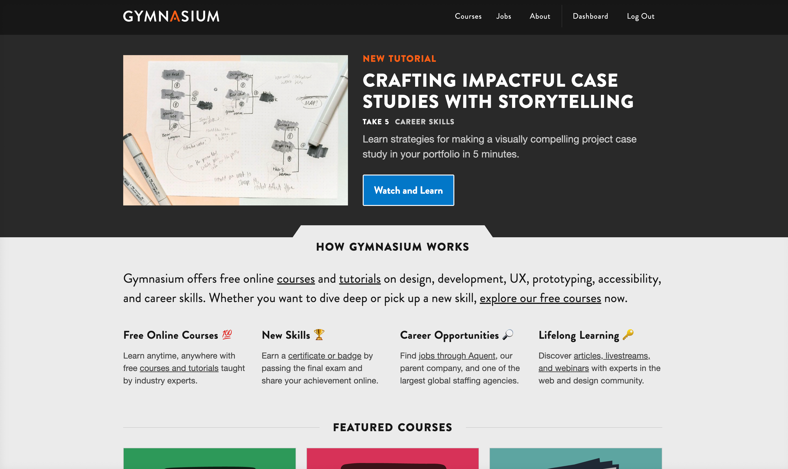

## Introduction

Roman Edirisinghe, Director of Technology

- working with the web since 1996
- background in art
- largely self-taught

Note:
I'm Roman Edirisinghe, the hat I wear  Gymnasium’s director of technology. I joined Gymnasium in 2021, and had no prior experience with Open edX.

---

## Beginnings
Vanilla Open edX vs Gymnasium's Open edX

- Gymnasium's Hawthorn theme was heavily customized
- Upgrading became a challenge
- "Stuck" on Hawthorn since 2020
- adding new pages required intervention of hosting provider

Note:
What ensued was a crash course not just into Open edX, but also into how the Gymnasium team had customized the platform.

---

## Before

Gymnasium's Hawthorn-based custom theme:
- Used a SSG (Jekyll) to include pre-generated HTML fragments within the LMS
- Our marketing site and LMS were effectively one and the same.
- But we still **needed** our hosting provider to generate new pages.
- We were hampered by the limitations of Open edX. [REVISE]

Note:

---

## Hosting Woes

Sometimes, partnerships have to change.

- loveless marriage <!-- .element: class="fragment" data-fragment-index="1" -->
- it's not you, it's me <!-- .element: class="fragment" data-fragment-index="2" -->
- (but it's actually you) <!-- .element: class="fragment" data-fragment-index="3" -->

Notes:
We realized the relationship with our hosting provider was not what it used to be. Our hosting provider had changed hands and it became apparent that they were no longer able to meet our needs.

---

## Change is Inevitable

- Research new hosting providers
- Discovery that an upgrade is necessary
- We knew we were on a sinking ship
- Urgency was paramount
- Change the overall architecture (frontend + LMS)

Note: 

---

## Post Hawthorn Open edX (Olive...Palm)

- MFEs
- Noticed MFEs weren't built consistently
- Confusing implementation - some parts of LMS were the theme, others were MFEs.

Note:
Started learning the MFEs in 2023/2024 etc.

---

## Redwood Upgrade

- Upgrade from hawthorn (2018) to redwood (2024)
- Our very talented collaborator Amir Tadrisi wrote some fancy scripts to automatically migrate data from version to version.

Note:
The next slide shows how many versions Amir needed to process.

---

## Versions

**hawthorn >** <!-- .element: class="fragment" data-fragment-index="1" --> 
**ironwood >** <!-- .element: class="fragment" data-fragment-index="2" --> 
**juniper >** <!-- .element: class="fragment" data-fragment-index="3" --> 
**koa >** <!-- .element: class="fragment" data-fragment-index="4" --> 
**lilac >** <!-- .element: class="fragment" data-fragment-index="5" --> 
**maple >** <!-- .element: class="fragment" data-fragment-index="6" --> 
**olive >** <!-- .element: class="fragment" data-fragment-index="7" --> 
**palm >** <!-- .element: class="fragment" data-fragment-index="8" --> 
**quince >** <!-- .element: class="fragment" data-fragment-index="9" --> 
**redwood** <!-- .element: class="fragment" data-fragment-index="10" -->

Notes:
Could you imagine going through these manually? We will leave you a QR code to contact Amir should you need his consulting expertise.

---

## Pain = Healing
The upgrade was huge pain point, but Amir's help made this step so much easier.

10 versions in 10 hours, with 10 days of prep & planning.

Note: 

---

## Architectural Goal Flowchart

Note: 

---

## Site Build Process Overview

- Process is streamlined and reduces the dependency/intervention from the hosting provider. 
- We make changes in the SSG, deploy that (2-5 minutes)
- Trigger a rebuild of the open edx systems (35-45 minutes)

Note:
We are the ideal client for hosting providers - the only intervention hosting providers needed was to handle emergencies.

---

<!-- .slide: data-background="purple" class="" -->

## Truth = YAML + JSON <!-- .element: class="r-fit-text" -->

Note:
YAML/JSON as a source of truth - showing stages of “the truth”.

---

<!-- .slide: data-background="blue" class="" -->
## Navigation

Notes: Here's an example of the YAML that governs our navigation.

------

<!-- .slide: data-auto-animate -->
<h2 data-id="code-title">Navigation YAML</h2>
<pre class="code-wrapper" data-id="code-animation">
  <code class="language-yml" data-line-numbers="|3-9|11-16|17-21|22-30" data-trim> 
header:
  nav:
    main:
    - label: Courses
      href: GYM_ROOT_URL/courses/
    - label: Jobs
      href: GYM_ROOT_URL/jobs/
    - label: About
      href: GYM_ROOT_URL/about/
    auth:
      public:
      - label: Sign In
        href: GYM_LMS_URL/login
      - label: Sign Up
        href: GYM_LMS_URL/register
        class: btn
      private:
      - label: Dashboard
        href: GYM_LMS_URL/dashboard
      - label: Log Out
        href: GYM_LMS_URL/logout
    courses:
    - label: Full Courses
      href: GYM_ROOT_URL/courses/full/
    - label: Gym Shorts
      href: GYM_ROOT_URL/courses/gym-shorts/
    - label: Take 5 Tutorials
      href: GYM_ROOT_URL/courses/take5/
    - label: Collections
      href: GYM_ROOT_URL/collections/
  </code>
</pre>

Note:
In this example, I'll step through the various sections of YAML, each of which will get processed and transformed.

------

<!-- .slide: data-auto-animate -->

## Navigation JSON

<pre class="code-wrapper" data-id="code-animation">
  <code class="language-json" data-line-numbers="|2-15|17-27|28-37|39-56" data-trim>
"nav": {
  "main": [
    {
      "label": "Courses",
      "href": "https://thegymnasium.com/courses/"
    },
    {
      "label": "Jobs",
      "href": "https://thegymnasium.com/jobs/"
    },
    {
      "label": "About",
      "href": "https://thegymnasium.com/about/"
    }
  ],
  "auth": {
    "public": [
      {
        "label": "Sign In",
        "href": "https://learn.thegymnasium.com/login"
      },
      {
        "label": "Sign Up",
        "href": "https://learn.thegymnasium.com/register",
        "class": "btn"
      }
    ],
    "private": [
      {
        "label": "Dashboard",
        "href": "https://learn.thegymnasium.com/dashboard"
      },
      {
        "label": "Log Out",
        "href": "https://learn.thegymnasium.com/logout"
      }
    ]
  },
  "courses": [
    {
      "label": "Full Courses",
      "href": "https://thegymnasium.com/courses/full/"
    },
    {
      "label": "Gym Shorts",
      "href": "https://thegymnasium.com/courses/gym-shorts/"
    },
    {
      "label": "Take 5 Tutorials",
      "href": "https://thegymnasium.com/courses/take5/"
    },
    {
      "label": "Collections",
      "href": "https://thegymnasium.com/collections/"
    }
  ]
}
  </code>
</pre>

Note:
The YAML gets processed by eleventy, which spits out the JSON. Take note that the GYM_ROOT_URL and GYM_LMS_URL text strings have been replaced by the actual URL. We did this to support our development, staging, and production environments.

This JSON is consumed by the MFEs + LMS at build time.

------

<!-- .slide: data-auto-animate -->

### Navigation (Public)

<!-- .element: class="r-fit-text" data-id="screencap" -->

Note: 
The home page for public visitors.

------

<!-- .slide: data-auto-animate -->

### Navigation (Logged-In)

<!-- .element: class="r-fit-text" data-id="screencap" -->

Note: 
The home page for logged in users.

------

<!-- .slide: data-auto-animate -->

### Dashboard

<!-- .element: class="r-fit-text" data-id="screencap" -->

Note: 
The dashboard navigation.

------

<!-- .slide: data-auto-animate -->

### Course Navigation

<!-- .element: class="r-fit-text" data-id="screencap" -->

Note: 
The course navigation (in this case, Gym Shorts)

---

<!-- .slide: data-background="green" class="" -->

## Example: meta data <!-- .element: class="r-fit-text" -->

Note:

------

## YAML (Meta)

(add code block)

Note:
This is what our YAML looks like.

------

## JSON (Meta)

(add code block)

Note: 
The JSON gets generated from the YAML.

------

## HTML (Meta)

(add code block)

Note: 
And the resulting rendered HTML.

---

## TODO: show more Rendered Components

TBD...

Screencaps of rendered pages:
- Unified navigation
- Unified footer
- 404 page
- Banner

Note:
Potential screencaps of rendered pages:
- Unified navigation
- Unified footer
- 404 page
- Banner

---

## CSS (SCSS)

- CSS being served from SSG (eleventy)
- Required disabling default CSS of MFEs. 
- Pitfalls: discovery that some development of MFEs resulted in CSS rules declared 8-10x (link to the issue)

Note:

---

## MFEs: Gymnasium Frontend Components

`gym-frontend-components` serves up the following react components:

- header
- footer
- custom 404 page
- banner
- overrides to core MFE behaviors

Note:
Rather than serve our header, footer, and overrides from different repositories, we created one repo to meet our needs. One repo to rule them all.

