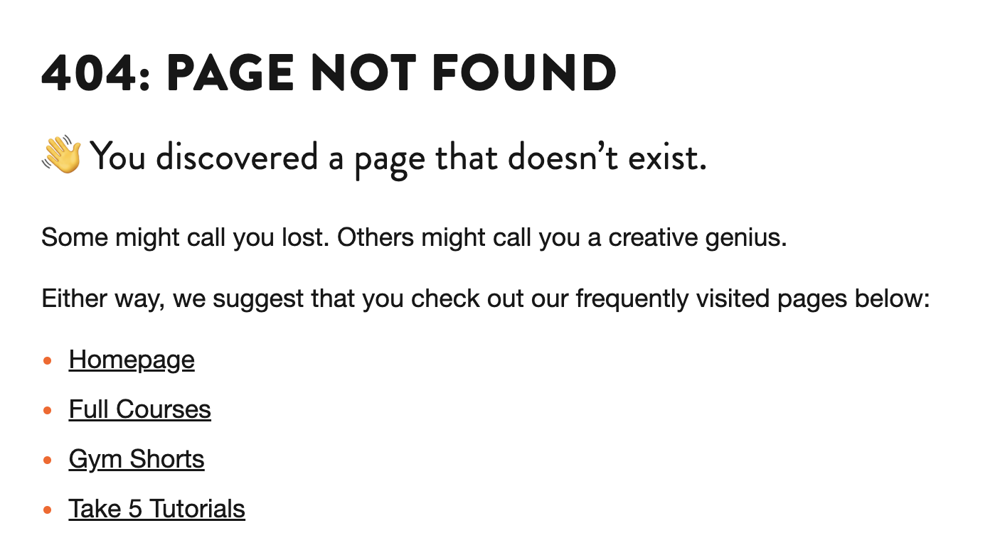

## Hi, I'm Roman 🇱🇰 🇷🇺 🇺🇸

Director of Technology <!-- .element: class="fragment" data-fragment-index="1" -->

Notes:
I'm Roman Edirisinghe, and I'm Gymnasium’s director of technology.

------

### since '96 <!-- .element: class="hide" -->

working with the web since 1996

Notes:
I started working on the web in 1996

------

### art background <!-- .element: class="hide" -->

background in art

Notes:
I have a background in art, not computer science

------

### self-taught <!-- .element: class="hide" -->

largely self-taught

Notes:
- Perhaps it's not unusual these days, but I'm largely self taught with regard to the web.

------

### joined team in 2021 <!-- .element: class="hide" -->

joined Gymnasium in 2021

Notes:
- no prior experience with Open edX before 2021, only a little bit of Python
- What ensued was a crash course not just into Open edX, but also into how the Gymnasium team had customized the platform

------

### always a better way <!-- .element: class="hide" -->

there is always a better way

Notes:
- with these things in mind, this could mean there are better ways to do what we did, and we welcome any feedback

---

## Pre-upgrade recap

------

### theme customized <!-- .element: class="hide" -->

theme was heavily customized

Notes:
- Gymnasium's Hawthorn based theme was very customized
- Used a SSG (Jekyll) to include pre-generated HTML fragments within the LMS
- Our marketing site and LMS were effectively one and the same.

------

### pages = extra steps <!-- .element: class="hide" -->

new pages = extra steps

Notes:

- we **needed** our hosting provider to generate new pages

------

### upgrade = challenge <!-- .element: class="hide" -->

upgrading code became a challenge

Notes:
- "Stuck" on Hawthorn since 2020
- We were hampered by the limitations of Open edX. [REVISE]
- [revise] do we use a word other than upgrade/migration to encompass both?

---

## A change of hands 🤝

Notes:
- the relationship with our hosting provider had changed
- they were no longer able to meet our needs.

------

### it's not you, it's me <!-- .element: class="hide" -->

it's not you, it's me

Notes:

------

### but it's actually you <!-- .element: class="hide" -->

(but it's actually you)

Notes:

---

### Core requirements

Notes:
- design leads development
  - eleventy
- rapid deployment
  - eleventy
- login "awareness" on static site
- open edx version upgrade/migration
- achieving a consistent experience (UX/UI)
  - new catalog
    - using static site instead of LMS
    - reference "overloading" hawthorn to customize the catalog
    - choosing to use eleventy to serve course catalog and course about pages instead of LMS
    - user research and prototyped development of a revised catalog
    - using SSG made it easier to develop new features
  - new courseware
    - adding the "how it works" section instead of "overloaded" course updates section serving as syllabus [maybe not necessary]
    - ...
  - header
    - show comparison of original nav vs new
    - show code samples - yaml to json
    - introduce header states (currrent page state, etc)
  - footer
    - design/development worked together
      - hawthorn footer
      - new footer
    - "dumb" footer - no states to the buttons
      - no MFE needed active state of any footer links
  - banner (last thing we show)

------

### rapid deployment <!-- .element: class="hide" -->

rapid deployment

Notes:

------

### login "awareness" <!-- .element: class="hide" -->

login "awareness" on static site

Notes:

------

### version upgrade <!-- .element: class="hide" -->

open edx version upgrade

Notes:
Implied in the upgrade or upgrades is the data migration required

------

### seamless experience <!-- .element: class="hide" -->

achieving a seamless experience

Notes:
- YAML + JSON
- custom react components
- CSS served from static site

---

<!-- .slide: data-background="black" class="" -->

## Truth = YAML + JSON <!-- .element: class="r-fit-text" -->

Notes:
YAML/JSON as a source of truth - showing stages of “the truth”.

Some may ask, why not just write your truth in JSON - the answer:  YAML is much easier to read and write, doesn't require curly braces and quotes everywhere.

The second reason, is the JSON is consumed exclusively by the LMS portion of our setup - the MFEs + the theme

------

## YAML

YAML is the maintainer's source of truth.

<pre class="code-wrapper" data-id="code-animation">
  <code class="language-yml" data-line-numbers data-trim> 
%YAML 1.2
---
YAML: YAML Ain't Markup Language™

What It Is:
  YAML is a human-friendly data serialization
  language for all programming languages.
  </code>
</pre>

Notes:

------

## JSON

JSON is exclusively for consumption by the LMS (MFEs + theme)

Notes:

---

<!-- .slide: data-background="black" class="" -->
## Navigation

Notes: Here's an example of the YAML that governs our navigation.

------

<!-- .slide: data-auto-animate -->
<h2 data-id="code-title">Navigation YAML</h2>
<pre class="code-wrapper" data-id="code-animation">
  <code class="language-yml" 
    data-line-numbers="|3-9|11-16|17-21|22-30" 
    data-trim
    data-url="code-samples/nav.yaml"
  ></code>
</pre>

Notes:
In this example, I'll step through the various sections of YAML, each of which will get processed and transformed.

------

<!-- .slide: data-auto-animate -->

## Navigation JSON

<pre class="code-wrapper" data-id="code-animation">
  <code class="language-json"
    data-line-numbers="|3-16|18-28|29-38|40-57"
    data-trim
    data-url="code-samples/nav.json"
    ></code>
</pre>

Notes:
The YAML gets processed by eleventy, which spits out the JSON. Take note that the GYM_ROOT_URL and GYM_LMS_URL text strings have been replaced by the actual URL. We did this to support our development, staging, and production environments.

This JSON is consumed by the MFEs + LMS at build time.

------

<!-- .slide: data-auto-animate -->

### Navigation: Public

<!-- .element: class="r-fit-text" data-id="screencap" -->

Notes:
The home page for public visitors.

------

<!-- .slide:  -->

### Navigation: Logged-In

<!-- .element: class="r-fit-text" data-id="screencap" -->

Notes:
The home page for logged in users.

------

<!-- .slide:  -->

### Navigation: Dashboard

<!-- .element: class="r-fit-text" data-id="screencap" -->

Notes:
The dashboard navigation.

------

<!-- .slide:  -->

### Navigation: Course

<!-- .element: class="r-fit-text" data-id="screencap" -->

Notes:
The course navigation (in this case, Gym Shorts)

---

<!-- .slide: data-background="black" class="" -->
## Footer

Notes: This is the YAML for our site footer

------

<!-- .slide: data-auto-animate -->
<h2 data-id="code-title">Footer YAML</h2>
<pre class="code-wrapper" data-id="code-animation">
  <code class="language-yml" 
    data-disable- line-numbers="|2-22|23-38|39-57|58-114|115-136|138-151|152-159|160-191"
    data-trim
    data-url="code-samples/footer.yaml"
    ></code>
</pre>

Notes:
Our footer YAML is processed a little differently - we generate all the HTML for the footer first, then embed the entirety of the HTML inside the JSON. This escaped HTML gets included in the MFEs + theme at build time.

------

## Footer HTML

<pre class="code-wrapper" data-id="code-animation">
  <code class="language-html"
    data-line-numbers=""
    data-trim
    data-url="code-samples/footer.html"
    ></code>
</pre>

Notes:

------

<!-- .slide: data-auto-animate -->

## Footer JSON

<pre class="code-wrapper" data-id="code-animation">
  <code class="language-json"
    data-line-numbers=""
    data-trim
    data-url="code-samples/footer.json"
    ></code>
</pre>

Notes: Here is the escaped HTML embedded in the JSON

------

<!-- .slide:  -->

### Footer

<!-- .element: class="r-fit-text" data-id="screencap" -->

Notes:
The unified site footer - this looks the same across the eleventy static site and the MFEs. The only difference is the links in the MFE/theme version point back to the static site.

---

<!-- .slide: data-background="black" class="" -->

## Site banner

Notes:
Used for sitewide notifications, we handle this similar to the footer - by embedding the entirety of it within the JSON.

------

<!-- .slide: data-auto-animate -->

<h2 data-id="code-title">Site banner YAML</h2>
<pre class="code-wrapper" data-id="code-animation">
  <code class="language-yml"
    data-line-numbers=""
    data-trim
    data-url="code-samples/banner.yaml"
    ></code>
</pre>

Notes:
(note to self: this is another potential teaser about the conclusion)

------

<!-- .slide: data-auto-animate -->

<h2 data-id="code-title">Site banner HTML</h2>
<pre class="code-wrapper" data-id="code-animation">
  <code class="language-html"
    data-line-numbers=""
    data-trim
    data-url="code-samples/banner.html"
    ></code>
</pre>

Notes:
(note to self: this is another potential teaser about the conclusion)

------

<!-- .slide: data-background="black" class="" -->

### Site banner

<!-- .element: class="r-fit-text" data-id="screencap" -->

Notes:
(note to self: this is another potential teaser about the conclusion)

---

<!-- .slide: data-background="black" class="" -->

## Errors

Notes:
Here's how we approach handling customized error messaging.

------

<!-- .slide: data-auto-animate -->

<h2 data-id="code-title">404 YAML</h2>
<pre class="code-wrapper" data-id="code-animation">
  <code class="language-yml"
    data-line-numbers=""
    data-trim
    data-url="code-samples/error-404.yaml"
    ></code>
</pre>

Notes:

------

<!-- .slide: data-auto-animate -->

<h2 data-id="code-title">404 HTML</h2>
<pre class="code-wrapper" data-id="code-animation">
  <code class="language-html"
    data-line-numbers=""
    data-trim
    data-url="code-samples/error-404.html"
    ></code>
</pre>

Notes:

------

<!-- .slide: data-background="black" class="" -->

### 404 Page

<!-- .element: class="r-fit-text" data-id="screencap" -->

Notes:

---

<!-- .slide: data-background="black" class="" -->

## Meta data

Notes: 

------

<!-- .slide: data-auto-animate -->

<h2 data-id="code-title">Meta YAML</h2>
<pre class="code-wrapper" data-id="code-animation">
  <code class="language-yml"
    data-line-numbers="|8"
    data-trim
    data-url="code-samples/meta.yaml"
    ></code>
</pre>

Notes:
Here's an example of how we handle the site meta - those unseen elements that are so useful for SEO and web crawling spiders sent by search engines such as Google, Yahoo, Bing, etc, ad nauseam

Oh wait, what's Twitter doing there?

Let's cancel that.

------

<!-- .slide: data-auto-animate -->

<h2 data-id="code-title">Meta YAML</h2>
<pre class="code-wrapper" data-id="code-animation">
  <code class="language-yml"
    data-line-numbers
    data-trim
    data-url="code-samples/meta.yaml"
    data-line-end="7"
    ></code>
</pre>

Notes:
Next, the JSON

------

### META JSON

<pre class="code-wrapper" data-id="code-animation">
  <code class="language-json"
    data-line-numbers
    data-trim
    data-url="code-samples/meta.json"
    ></code>
</pre>

Notes:
The JSON gets generated from the YAML.

------

### Meta HTML

<pre class="code-wrapper" data-id="code-animation">
  <code class="language-html"
    data-line-numbers="6,10,11,12,13,14"
    data-trim
    data-url="code-samples/meta.html"
    ></code>
</pre>

Notes:
And the resulting rendered HTML.

---

## Custom react components

Notes:
Rather than serve our header, footer, and overrides from different repositories, we created one repo to meet our needs. One repo to rule them all.

------

### One "library"

`gym-frontend-components`

Notes:
One react library handles delivery of...

------

### react header <!-- .element: class="hide" -->

header

Notes: the header...

------

### react footer <!-- .element: class="hide" -->

footer

Notes: the footer...

------

### react 404 <!-- .element: class="hide" -->

404 errors, etc.

Notes: the error pages...

------

### react banner <!-- .element: class="hide" -->

banner

Notes: the site banner...

------

### react overrides <!-- .element: class="hide" -->

overrides to core MFE behaviors

Notes: ...and last but not least, the individual customizations we made to MFEs.
All by consuming our custom JSON at build time.

---

## And that's how we did it.

Notes: 
(maybe show banner next). oh wait, I meant to show you the banner.
