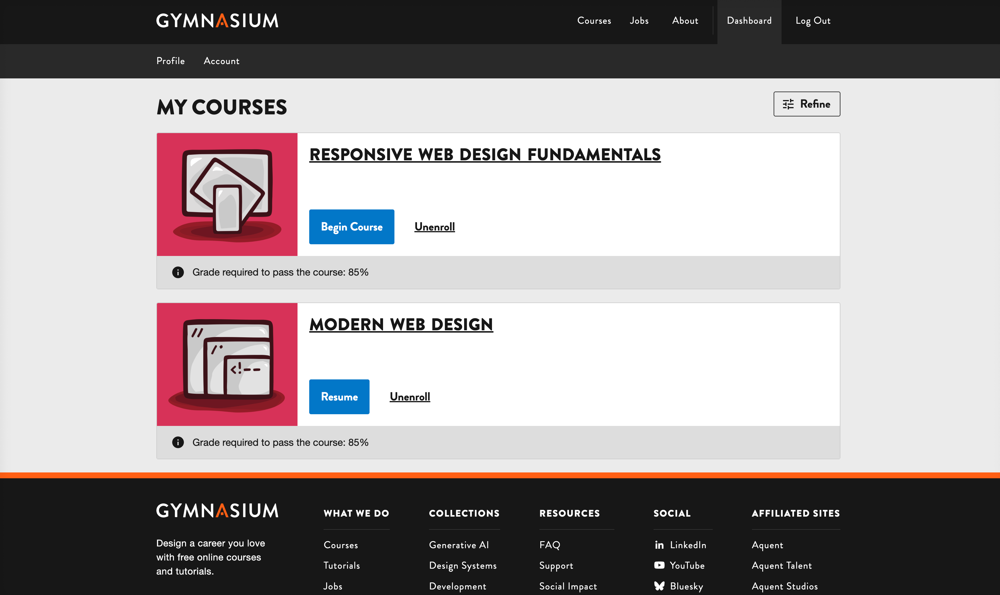
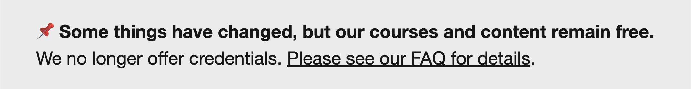

## Roman Edirisinghe
Director of Technology

- working with the web since 1996
- background in art
- largely self-taught

Notes:
I'm Roman Edirisinghe, and I'm Gymnasium’s director of technology. I joined Gymnasium in 2021, and had no prior experience with Open edX.

---

## Beginnings

Vanilla Open edX vs Gymnasium's Open edX

- Gymnasium's Hawthorn theme was heavily customized
- Upgrading became a challenge
- "Stuck" on Hawthorn since 2020
- adding new pages required intervention of hosting provider

Notes:
What ensued was a crash course not just into Open edX, but also into how the Gymnasium team had customized the platform.

---

## Recap

Gymnasium's Hawthorn-based custom theme:
- Used a SSG (Jekyll) to include pre-generated HTML fragments within the LMS
- Our marketing site and LMS were effectively one and the same.
- But we still **needed** our hosting provider to generate new pages.
- We were hampered by the limitations of Open edX. [REVISE]

Notes:

If we bored you at the beginning, here's more stuff to help you fall asleep.

---

## Sea Change Woes

Sometimes, partnerships have to change. <!-- .element: class="fragment" data-fragment-index="0" -->

- loveless marriage <!-- .element: class="fragment" data-fragment-index="1" -->
- it's not you, it's me <!-- .element: class="fragment" data-fragment-index="2" -->
- (but it's actually you) <!-- .element: class="fragment" data-fragment-index="3" -->

Notes:
We realized the relationship with our hosting provider was not what it used to be. Our hosting provider had changed hands and it became apparent that they were no longer able to meet our needs.

---

## Change is Inevitable

- Research new hosting providers
- Discovery that an upgrade is necessary
- We knew we were on a sinking ship
- Urgency was paramount
- Change the overall architecture (frontend + LMS)

Notes:

---

## Post Hawthorn Open edX (Olive...Palm)

- MFEs
- Noticed MFEs weren't built consistently
- Confusing implementation - some parts of LMS were the theme, others were MFEs.

Notes:
Started learning the MFEs in 2023/2024 etc.

---

## Redwood Upgrade

- Upgrade from Hawthorn (2018) to Redwood (2024)
- Our very talented collaborator Amir Tadrisi wrote some fancy scripts to automatically migrate data from version to version.

Notes:
The next slide shows how many versions Amir needed to process.

---

## Versions

**Hawthorn >** <!-- .element: class="fragment" data-fragment-index="1" --> 
**Ironwood >** <!-- .element: class="fragment" data-fragment-index="2" --> 
**Juniper >** <!-- .element: class="fragment" data-fragment-index="3" --> 
**Koa >** <!-- .element: class="fragment" data-fragment-index="4" --> 
**Lilac >** <!-- .element: class="fragment" data-fragment-index="5" --> 
**Maple >** <!-- .element: class="fragment" data-fragment-index="6" --> 
**Olive >** <!-- .element: class="fragment" data-fragment-index="7" --> 
**Palm >** <!-- .element: class="fragment" data-fragment-index="8" --> 
**Quince >** <!-- .element: class="fragment" data-fragment-index="9" --> 
**Redwood** <!-- .element: class="fragment" data-fragment-index="10" -->

Notes:
Could you imagine going through these manually? We will leave you a QR code to contact Amir should you need his consulting expertise.

---

## Pain = Healing
The upgrade was huge pain point, but Amir's help made this step so much easier.

10 versions in 10 hours, with 10 days of prep & planning.

Notes:

---

## Architectural Goal Flowchart

Notes:

------

## Steps/Process

Why? Updating styles from one source is much easier/faster than updating it in 8 different places.

1. disable built-in MFE CSS
    - cleanup
2. disable theme CSS
3. use eleventy to deliver CSS to MFEs + theme 

Notes:

---

## Site Build Process Overview

- Process is streamlined and reduces the dependency/intervention from the hosting provider. 
- We make changes in the SSG, deploy that (2-5 minutes)
- Trigger a rebuild of the open edx systems (35-45 minutes)

Notes:
We are the ideal client for hosting providers - the only intervention hosting providers needed was to handle emergencies.

---

<!-- .slide: data-background="black" class="" -->

## Truth = YAML + JSON <!-- .element: class="r-fit-text" -->

Notes:
YAML/JSON as a source of truth - showing stages of “the truth”.

Some may ask, why not just write your truth in JSON - the answer:  YAML is much easier to read and write, doesn't require curly braces and quotes everywhere.

The second reason, is the JSON is consumed exclusively by the LMS portion of our setup - the MFEs + the theme

------

## YAML

YAML is the maintainer's source of truth.

<pre class="code-wrapper" data-id="code-animation">
  <code class="language-yml" data-line-numbers data-trim> 
%YAML 1.2
---
YAML: YAML Ain't Markup Language™

What It Is:
  YAML is a human-friendly data serialization
  language for all programming languages.
  </code>
</pre>

Notes:

------

## JSON

JSON is exclusively for consumption by the LMS (MFEs + theme)

Notes:

---

<!-- .slide: data-background="black" class="" -->
## Navigation

Notes: Here's an example of the YAML that governs our navigation.

------

<!-- .slide: data-auto-animate -->
<h2 data-id="code-title">Navigation YAML</h2>
<pre class="code-wrapper" data-id="code-animation">
  <code class="language-yml" data-line-numbers="|3-9|11-16|17-21|22-30" data-trim> 
header:
  nav:
    main:
    - label: Courses
      href: GYM_ROOT_URL/courses/
    - label: Jobs
      href: GYM_ROOT_URL/jobs/
    - label: About
      href: GYM_ROOT_URL/about/
    auth:
      public:
      - label: Sign In
        href: GYM_LMS_URL/login
      - label: Sign Up
        href: GYM_LMS_URL/register
        class: btn
      private:
      - label: Dashboard
        href: GYM_LMS_URL/dashboard
      - label: Log Out
        href: GYM_LMS_URL/logout
    courses:
    - label: Full Courses
      href: GYM_ROOT_URL/courses/full/
    - label: Gym Shorts
      href: GYM_ROOT_URL/courses/gym-shorts/
    - label: Take 5 Tutorials
      href: GYM_ROOT_URL/courses/take5/
    - label: Collections
      href: GYM_ROOT_URL/collections/
  </code>
</pre>

Notes:
In this example, I'll step through the various sections of YAML, each of which will get processed and transformed.

------

<!-- .slide: data-auto-animate -->

## Navigation JSON

<pre class="code-wrapper" data-id="code-animation">
  <code class="language-json" data-line-numbers="|2-15|17-27|28-37|39-56" data-trim>
"nav": {
  "main": [
    {
      "label": "Courses",
      "href": "https://thegymnasium.com/courses/"
    },
    {
      "label": "Jobs",
      "href": "https://thegymnasium.com/jobs/"
    },
    {
      "label": "About",
      "href": "https://thegymnasium.com/about/"
    }
  ],
  "auth": {
    "public": [
      {
        "label": "Sign In",
        "href": "https://learn.thegymnasium.com/login"
      },
      {
        "label": "Sign Up",
        "href": "https://learn.thegymnasium.com/register",
        "class": "btn"
      }
    ],
    "private": [
      {
        "label": "Dashboard",
        "href": "https://learn.thegymnasium.com/dashboard"
      },
      {
        "label": "Log Out",
        "href": "https://learn.thegymnasium.com/logout"
      }
    ]
  },
  "courses": [
    {
      "label": "Full Courses",
      "href": "https://thegymnasium.com/courses/full/"
    },
    {
      "label": "Gym Shorts",
      "href": "https://thegymnasium.com/courses/gym-shorts/"
    },
    {
      "label": "Take 5 Tutorials",
      "href": "https://thegymnasium.com/courses/take5/"
    },
    {
      "label": "Collections",
      "href": "https://thegymnasium.com/collections/"
    }
  ]
}
  </code>
</pre>

Notes:
The YAML gets processed by eleventy, which spits out the JSON. Take note that the GYM_ROOT_URL and GYM_LMS_URL text strings have been replaced by the actual URL. We did this to support our development, staging, and production environments.

This JSON is consumed by the MFEs + LMS at build time.

------

<!-- .slide: data-auto-animate -->

### Navigation: Public

<!-- .element: class="r-fit-text" data-id="screencap" -->

Notes:
The home page for public visitors.

------

<!-- .slide:  -->

### Navigation: Logged-In

<!-- .element: class="r-fit-text" data-id="screencap" -->

Notes:
The home page for logged in users.

------

<!-- .slide:  -->

### Navigation: Dashboard

<!-- .element: class="r-fit-text" data-id="screencap" -->

Notes:
The dashboard navigation.

------

<!-- .slide:  -->

### Navigation: Course

<!-- .element: class="r-fit-text" data-id="screencap" -->

Notes:
The course navigation (in this case, Gym Shorts)

---

<!-- .slide: data-background="black" class="" -->
## Footer

Notes: This is the YAML for our site footer

------

<!-- .slide: data-auto-animate -->
<h2 data-id="code-title">Footer YAML</h2>
<pre class="code-wrapper" data-id="code-animation">
  <code class="language-yml" 
    data-disable- line-numbers="|2-22|23-38|39-57|58-114|115-136|138-151|152-159|160-191" data-trim> 
footer:
  nav:
    - title: What We Do
      links:
        - label: Courses
          href: GYM_ROOT_URL/courses/
        - label: Tutorials
          href: GYM_ROOT_URL/courses/take5/
        - label: Jobs
          href: GYM_ROOT_URL/jobs/
        - label: Articles
          href: https://medium.com/gymnasium
          target: _blank
          rel: noopener
        - label: Livestreams
          href: https://www.youtube.com/@AquentGymnasium/streams
          target: _blank
          rel: noopener
        - label: Webinars
          href: GYM_ROOT_URL/webinars/
        - label: About
          href: GYM_ROOT_URL/about/
    - title: Collections
      links:
        - label: Generative AI
          href: GYM_ROOT_URL/generative-ai/
        - label: Design Systems
          href: GYM_ROOT_URL/design-systems/
        - label: Development
          href: GYM_ROOT_URL/development/
        - label: UX Design
          href: GYM_ROOT_URL/ux-design/
        - label: Prototyping
          href: GYM_ROOT_URL/prototyping/
        - label: Accessibility
          href: GYM_ROOT_URL/accessibility/
        - label: Career Skills
          href: GYM_ROOT_URL/career-skills/
    - title: Resources
      links:
        - label: FAQ
          href: GYM_ROOT_URL/faq/
        - label: Support
          href: GYM_ROOT_URL/support/
        - label: Social Impact
          href: GYM_ROOT_URL/social-impact/
        - label: Privacy Policy
          href: GYM_ROOT_URL/privacy-policy/
          rel: privacy-policy
        - label: Corporate Social Responsibility
          href: https://aquent.com/csr-policy
          target: _blank
          rel: noopener
        - label: Impressum
          href: https://aquent.de/impressum/
          target: _blank
          rel: noopener
    - title: Social
      img:
        attr:
          decoding: async
          fetchpriority: low
          width: 20
          height: 20
      links:
        - label: LinkedIn
          href: https://www.linkedin.com/school/gymnasium/
          target: _blank
          rel: noopener
          alt: LinkedIn “in” icon.
          src: png/icon-linkedin-4x.png
          srcset: svg/icon-linkedin.svg
        - label: YouTube
          href: https://www.youtube.com/AquentGymnasium
          target: _blank
          rel: noopener
          alt: YouTube play button icon.
          src: png/icon-youtube-4x.png
          srcset: svg/icon-youtube.svg
        - label: Bluesky
          href: https://bsky.app/profile/aquentgymnasium.bsky.social
          target: _blank
          rel: noopener
          alt: Bluesky butterfly icon.
          src: png/icon-bluesky-4x.png
          srcset: svg/icon-bluesky.svg
        - label: Threads
          href: https://www.threads.net/@aquent_gymnasium
          target: _blank
          rel: noopener
          alt: Threads ampersand-esque icon.
          src: png/icon-threads-4x.png
          srcset: svg/icon-threads.svg
        - label: Instagram
          href: https://www.instagram.com/aquent_gymnasium/
          target: _blank
          rel: noopener
          alt: Instagram camera icon.
          src: png/icon-instagram-4x.png
          srcset: svg/icon-instagram.svg
        - label: Medium
          href: https://medium.com/gymnasium
          target: _blank
          rel: noopener
          alt: Medium ellipsis (dot, oval, thin oval) icon.
          src: png/icon-medium-4x.png
          srcset: svg/icon-medium.svg
        - label: GitHub
          href: https://github.com/gymnasium
          target: _blank
          rel: noopener
          alt: GitHub Octocat silhouette icon.
          src: png/icon-github-4x.png
          srcset: svg/icon-github.svg
    - title: Affiliated Sites
      links:
        - label: Aquent
          href: https://aquent.com
          target: _blank
          rel: noopener
        - label: Aquent Talent
          href: https://aquenttalent.com
          target: _blank
          rel: noopener
        - label: Aquent Studios
          href: https://aquentstudios.com
          target: _blank
          rel: noopener
        - label: Aquent RoboHead
          href: https://www.robohead.net
          target: _blank
          rel: noopener
        - label: Aquent Scout
          href: https://aquentscout.com
          target: _blank
          rel: noopener
  aside:
    - title: Platforms
      links:
        - href: https://openedx.org
          alt: Powered by Open edX.
          src: edx-openedx-logo-tag-dark.png
          srcset:
          width: 175
          height: 70
        - href: https://www.11ty.dev
          alt: 11ty or eleventy.
          src: 11ty-logo-400x400.png
          srcset:
          width: 400
          height: 400
    - title: Awards
      links:
        - href: https://americanstaffing.net/posts/2024/10/15/workforce-development-with-2024-elevate-awards/
          alt: American Staffing Association Elevete Awards.
          src: asa-elevate-awards.png
          srcset:
          width: 254
          height: 170
    - title: Press
      links:
        - href: https://www.fastcompany.com/3024661/hacking-hack-schools-to-make-them-work
          alt: Fast Company logo.
          src: fast-company.svg
          srcset: fast-company.svg
          width: 223
          height: 32
        - href: https://www.forbes.com/sites/sap/2015/02/23/hate-formal-career-training-go-guerrilla-on-it/
          alt: Forbes logo.
          src: forbes.svg
          srcset: forbes.svg
          width: 128
          height: 32
        - href: https://www.inc.com/issie-lapowsky/how-moocs-training-tomorrow-workforce.html
          alt: Inc logo.
          src: inc.svg
          srcset: inc.svg
          width: 93
          height: 32
        - href: https://www.lemonde.fr/emploi/article/2014/06/30/les-firmes-americaines-recrutent-dans-les-mooc_4448062_1698637.html
          alt: Le Monde .fr logo.
          src: le-monde-fr.svg
          srcset: le-monde-fr.svg
          width: 186
          height: 32
        - href: https://www.foxbusiness.com/features/training-workers-the-netflix-way-moocs-in-the-job-industry
          alt: Fox Business logo.
          src: fox-business.svg
          srcset: fox-business.svg
          width: 64
          height: 32
  a:
    attr:
      target: _blank
      rel: noopener
  img:
    attr:
      decoding: async
      fetchpriority: low
  </code>
</pre>

Notes:
Our footer YAML is processed a little differently - we generate all the HTML for the footer first, then embed the entirety of the HTML inside the JSON. This escaped HTML gets included in the MFEs + theme at build time.

------

## Footer HTML

<pre class="code-wrapper" data-id="code-animation">
  <code class="language-html" data-line-numbers="" data-trim>
    
  </code>
</pre>

Notes:

------

<!-- .slide: data-auto-animate -->

## Footer JSON

<pre class="code-wrapper" data-id="code-animation">
  <code class="language-json" data-line-numbers="" data-trim>

  </code>
</pre>

Notes: Here is the escaped HTML embedded in the JSON

------

<!-- .slide:  -->

### Footer

<!-- .element: class="r-fit-text" data-id="screencap" -->

Notes:
The unified site footer - this looks the same across the eleventy static site and the MFEs. The only difference is the links in the MFE/theme version point back to the static site.

---

<!-- .slide: data-background="black" class="" -->

## Site Banner

Notes:
Used for sitewide notifications, we handle this similar to the footer - by embedding the entirety of it within the JSON.

------

<!-- .slide: data-auto-animate -->

<h2 data-id="code-title">Site Banner YAML</h2>
<pre class="code-wrapper" data-id="code-animation">
  <code class="language-yml" data-line-numbers="" data-trim> 
    
  </code>
</pre>

Notes:

------

<!-- .slide: data-auto-animate -->

<h2 data-id="code-title">Site Banner HTML</h2>
<pre class="code-wrapper" data-id="code-animation">
  <code class="language-html" data-line-numbers="" data-trim> 
    
  </code>
</pre>

Notes:
(note to self: this is another potential teaser about the conclusion)

------

<!-- .slide: data-background="black" class="" -->

### Site Banner

<!-- .element: class="r-fit-text" data-id="screencap" -->

---

<!-- .slide: data-background="black" class="" -->

## Meta Data

Notes:

------

<!-- .slide: data-auto-animate -->

<h2 data-id="code-title">Meta YAML</h2>
<pre class="code-wrapper" data-id="code-animation">
  <code class="language-yml" data-line-numbers="|8" data-trim> 
meta:
  title: Gymnasium
  subtitle: Free online courses and tutorials on design and development.
  author: Aquent Gymnasium
  description: Design a career you love with our free online courses and tutorials on design, development, UX, prototyping, accessibility, and career skills.
  short_description: Design a career you love with free online courses and tutorials.
  og_img: /img/og/gym-brand.png
  twitter_handle: "@AquentGymnasium"
  </code>
</pre>

Notes:
Here's an example of how we handle the site meta - those unseen elements that are so useful for SEO and web crawling spiders sent by search engines such as Google, Yahoo, Bing, etc, ad nauseam

Oh wait, what's Twitter doing there?

Let's cancel that.

------

<!-- .slide: data-auto-animate -->

<h2 data-id="code-title">Meta YAML</h2>
<pre class="code-wrapper" data-id="code-animation">
  <code class="language-yml" data-line-numbers data-trim> 
meta:
  title: Gymnasium
  subtitle: Free online courses and tutorials on design and development.
  author: Aquent Gymnasium
  description: Design a career you love with our free online courses and tutorials on design, development, UX, prototyping, accessibility, and career skills.
  short_description: Design a career you love with free online courses and tutorials.
  og_img: /img/og/gym-brand.png
  </code>
</pre>

Notes:
Next, the JSON

------

## META JSON

<pre class="code-wrapper" data-id="code-animation">
  <code class="language-json" data-line-numbers data-trim>
"meta": {
  "title": "Gymnasium",
  "subtitle": "Free online courses and tutorials on design and development.",
  "author": "Aquent Gymnasium",
  "description": "Design a career you love with our free online courses and tutorials on design, development, UX, prototyping, accessibility, and career skills.",
  "short_description": "Design a career you love with free online courses and tutorials.",
  "og_img": "/img/og/gym-brand.png"
}
  </code>
</pre>

Notes:
The JSON gets generated from the YAML.

------

## Meta HTML

<pre class="code-wrapper" data-id="code-animation">
  <code class="language-html" data-line-numbers="6,10,11,12,13,14" data-trim>
    
  </code>
</pre>

Notes:
And the resulting rendered HTML.

---

## TODO: show more Rendered Components

TBD...

Screencaps of rendered pages:
- 404 page

Notes:
Potential screencaps of rendered pages:
- 404 page

---

## CSS (SCSS)

- CSS being served from SSG (eleventy)
- Required disabling default CSS of MFEs. 
- Pitfalls: discovery that some development of MFEs resulted in CSS rules declared 8-10x (link to the issue)

Notes:

---

## MFEs: Gymnasium Frontend Components

`gym-frontend-components` serves up the following react components:

- header
- footer
- custom 404 page
- banner
- overrides to core MFE behaviors

Notes:
Rather than serve our header, footer, and overrides from different repositories, we created one repo to meet our needs. One repo to rule them all.

