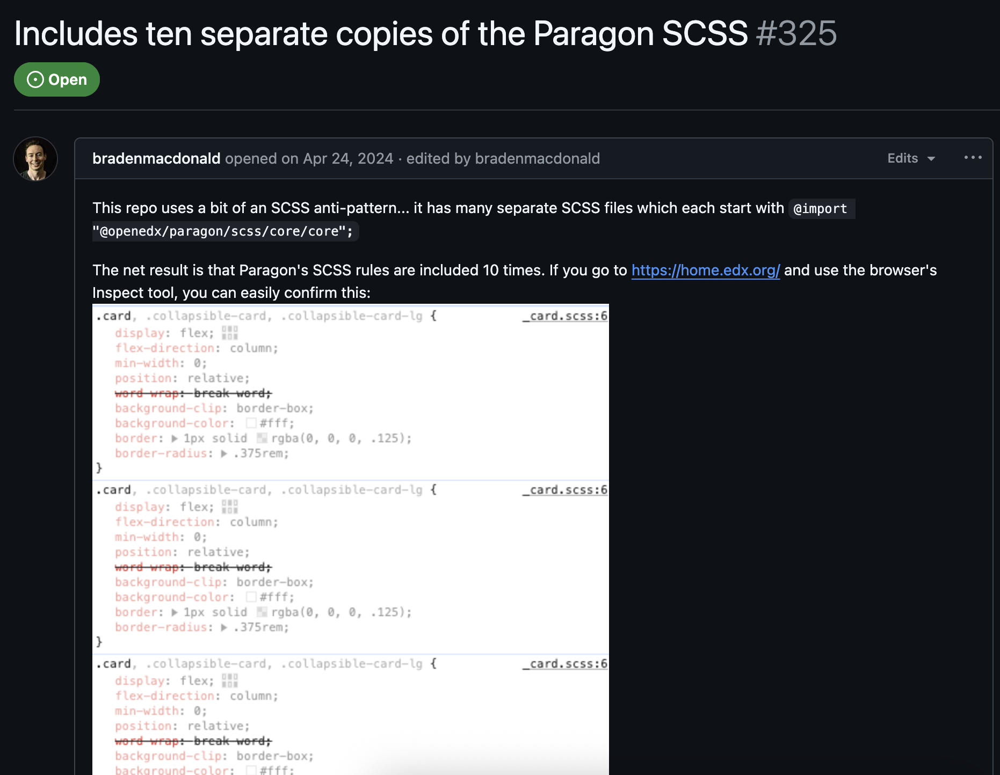

## Achieving seamlessness

Notes:
Let’s talk talk about the steps involved in achieving a consistent visual design.

------

#### flowchart <!-- .element: class="hide" -->

Notes:
- a reminder that this is what we ended up doing

------

#### Visual layer<!-- .element: class="hide" -->

disable default CSS

Notes:
- Why?
  - updating styles in one place is much easier/faster than updating it in 8 different places.
  - use eleventy’s 2 minute build time vs 35-45 minutes on average for deploying open edx changes.

Steps to achieving this:

1. disable built-in MFE CSS
    - cleanup
2. disable theme CSS
3. use eleventy to deliver CSS to MFEs + theme 

- Pitfalls: discovery that some development of MFEs resulted in CSS rules declared 8-10x (link to the issue)

------

#### 10 copies of CSS <!-- .element: class="hide" -->

<!-- .slide: data-background="black" class="" -->

Notes:
- it’s not just us noticing issues
- github issue logged by CTO of OpenCraft, Braden Macdonald
- CSS for the learner dashboard declared 10x
- choosing simplicity was a no-brainer for us

Github link https://github.com/openedx/frontend-app-learner-dashboard/issues/325

---

## Single source of truth

Notes:
- CSS from the 11ty
- YAML as the source of truth for content

------

<!-- .slide: data-background="black" class="" -->

### Truth = YAML + JSON<!-- .element: class="r-fit-text" -->

Notes:
YAML/JSON as a source of truth - showing stages of “the truth”.

Some may ask, why not just write your truth in JSON - the answer:  YAML is much easier to read and write, doesn’t require curly braces and quotes everywhere.

The second reason, is the JSON is consumed exclusively by the LMS portion of our setup - the MFEs + the theme

------

## YAML

YAML is the maintainer’s source of truth.

<pre class="code-wrapper" data-id="code-animation">
  <code class="language-yml" data-line-numbers data-trim> 
%YAML 1.2
---
YAML: YAML Ain’t Markup Language™

What It Is:
  YAML is a human-friendly data serialization
  language for all programming languages.
  </code>
</pre>

Notes:

------

## JSON

exclusively for consumption by the Open edX platform

Notes:
- platform = MFEs + theme

---

## Custom React components

Notes:

Rather than serve our header, footer, and overrides from different repositories, we created one repo to meet our needs. One repo to rule them all.

------

### One repo

`gym-frontend-components`

Notes:
- One react library handles delivery of...

------

### react header & footer<!-- .element: class="hide" -->

header and footer

Notes: the header...

------

### react 404, banner <!-- .element: class="hide" -->

404 errors, status banner, etc.

Notes:
- 404 errors, status banner, etc.

------

### react overrides<!-- .element: class="hide" -->

overrides to core MFE behaviors

Notes: 
- ...and last but not least, the individual customizations we made to MFEs.
All by consuming our custom JSON at build time.
- MFEs and where they might go...
- Adolfo's cool talk on development on `frontend-base`
- less is more
